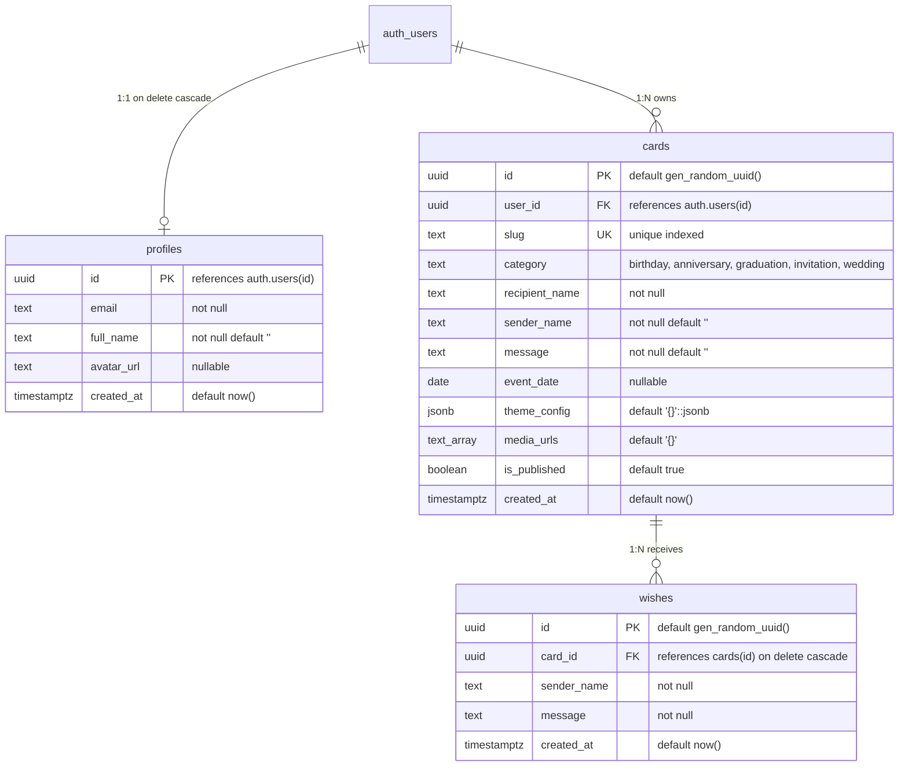
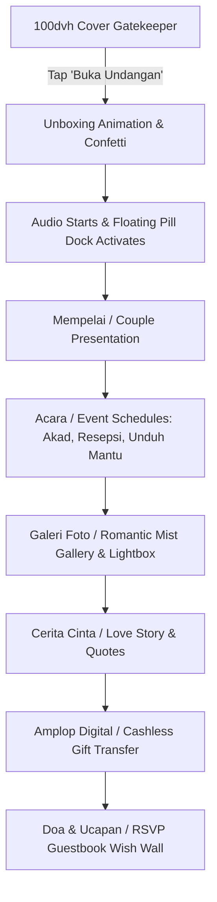
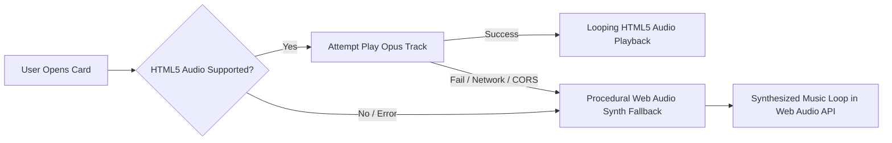

# ElCelebrate — Single Source of Truth & Project Context

> **Repository:** `elcelebrate`  
> **Target Audience:** Engineering Leads, Software Architects, and Agentic Systems  
> **Document Role:** Authoritative Single Source of Truth (SSOT)  
> **Runtime Target:** Astro v5 SSR on Cloudflare Pages / Workers (V8 Edge Runtime)  
> **Last Verified:** September 2026  

---

## Table of Contents

1. [Project Overview & Core Architecture](#1-project-overview--core-architecture)
2. [Technology Stack & Configuration Specification](#2-technology-stack--configuration-specification)
3. [Database Schema, Relations & Access Control (RLS)](#3-database-schema-relations--access-control-rls)
4. [Directory Map & Codebase Responsibility Matrix](#4-directory-map--codebase-responsibility-matrix)
5. [API Specification & SSR Routing](#5-api-specification--ssr-routing)
6. [Template & Media Engine Architecture](#6-template--media-engine-architecture)
7. [Extension Points & Future Architecture](#7-extension-points--future-architecture)

---

## 1. Project Overview & Core Architecture

### 1.1 Platform Overview
**ElCelebrate** is an ultra-lightweight, zero-cost-tier digital celebration and greeting card web platform. It enables users to create, customize, preview, manage, and share dynamic interactive digital cards and luxury long-scroll wedding invitations. The platform features 3D unboxing animations, dual-engine background audio (HTML5 Opus with procedural Web Audio synthesizer fallback), dynamic countdown timers, romantic photo mist galleries with full-screen lightboxes, digital cash gift envelopes, and public guestbook wish walls with RSVP tracking.

### 1.2 Architectural Principles & Zero-Cost Tier Design
The system is intentionally engineered to operate perpetually within the generous free tiers of modern edge and cloud infrastructure:

* **Pure Edge SSR:** The entire application runs on Cloudflare Pages / Workers via Astro v5 in full Server-Side Rendering (`output: 'server'`). Every SSR page and API endpoint executes in the V8 Edge isolate runtime with near-zero cold starts.
* **Client-Side Heavy Lifting:** Image resizing, aspect ratio normalization, and transcoding to WebP format are performed completely inside the visitor's browser using client Web Workers (`browser-image-compression`). The server never processes raw image binary uploads or handles CPU-intensive multipart form parsing.
* **Direct-to-Storage Uploads:** Clients request cryptographically signed S3 presigned PUT URLs (`/api/storage/presigned-url`) and upload compressed WebP assets directly to Cloudflare R2 object storage.
* **ISP DNS / SNI Block Immunity (Indonesia & Restricted Regions):** Public `*.r2.dev` domains are frequently blocked or throttled by regional Indonesian ISPs (e.g., Telkomsel, Indihome) due to blanket domain filtering. ElCelebrate solves this via a secure internal edge streaming proxy (`/api/media/[...path]`), which streams media assets directly through the primary application domain with immutable caching headers (`max-age=31536000, immutable`).
* **Automated Asset Garbage Collection:** Card updates (`PATCH /api/cards/[id]`), card deletions (`DELETE /api/cards/[id]`), and avatar replacements (`POST /api/profile/update`) automatically compute orphaned media keys and delete them permanently from Cloudflare R2 to prevent storage bloat.

---

## 2. Technology Stack & Configuration Specification

### 2.1 Technology Stack Matrix

| Layer | Technology | Exact Version | Configuration & Role |
| :--- | :--- | :--- | :--- |
| **Framework** | [Astro](https://astro.build/) | `^5.2.0` | Content-first web framework operating in full SSR mode (`output: 'server'`). |
| **Edge Adapter** | `@astrojs/cloudflare` | `^12.6.13` | Compiles Astro routes for execution on Cloudflare Pages/Workers V8 runtime. |
| **Styling Engine** | [Tailwind CSS v4](https://tailwindcss.com/) | `^4.0.0` | CSS-first configuration via `@import "tailwindcss";` and `@theme` tokens in `src/styles/global.css`. |
| **Vite Compiler** | `@tailwindcss/vite` | `^4.0.0` | Vite plugin integrating Tailwind v4 directly into Astro's build pipeline. |
| **Static Typing** | TypeScript + `@astrojs/check` | `^5.7.0` / `^0.9.0` | Strict TypeScript checking, JSX runtime definitions, and path aliases. |
| **Database & Auth** | Supabase (`@supabase/supabase-js`, `@supabase/ssr`) | `^2.49.0` / `^0.5.0` | PostgreSQL with Row-Level Security (RLS) & cookie-based SSR session management. |
| **Object Storage** | Cloudflare R2 (`@aws-sdk/client-s3`, `@aws-sdk/s3-request-presigner`) | `^3.700.0` / `^3.700.0` | S3-compatible client for presigned PUT uploads, streaming proxy reads, and deletes. |
| **Client Media** | `browser-image-compression` | `^2.0.2` | Multi-pass downscaling and WebP conversion (≤200KB photos, ≤100KB avatars) in Web Workers. |
| **Visual Effects** | `canvas-confetti` | `^1.9.3` | Dual-stage canvas particle shower triggered upon card unboxing. |
| **Iconography** | `lucide-astro` | `^0.460.0` | Zero-runtime SVG icons for UI actions, navigation, and badges. |
| **CLI & Deploy** | `wrangler` | `^4.131.1` | Cloudflare Workers/Pages CLI deployment and preview toolkit. |

### 2.2 Core Configuration Files

#### `package.json`
* **Name:** `elcelebrate` (ES Module, `"type": "module"`)
* **Scripts:**
  * `dev`: `astro dev` — Local development server
  * `build`: `astro build` — Production build targeting Cloudflare adapter
  * `preview`: `astro preview` — Preview production bundle locally
  * `check`: `astro check` — Runs `@astrojs/check` static type audits
  * `start`: `astro dev` — Alias for `dev`

#### `astro.config.mjs`
```javascript
import { defineConfig, passthroughImageService } from 'astro/config';
import cloudflare from '@astrojs/cloudflare';
import tailwindcss from '@tailwindcss/vite';

export default defineConfig({
  output: 'server',
  adapter: cloudflare({
    imageService: 'passthrough',
  }),
  image: {
    service: passthroughImageService(),
  },
  vite: {
    plugins: [tailwindcss()],
    resolve: {
      alias: {
        '@components': '/src/components',
        '@lib': '/src/lib',
        '@styles': '/src/styles',
      },
    },
  },
});
```

#### `wrangler.toml`
```toml
name = "elcelebrate"
compatibility_date = "2025-01-01"

[assets]
directory = "./dist/_astro"
```

#### `tsconfig.json`
```json
{
  "extends": "./node_modules/astro/tsconfigs/strict.json",
  "compilerOptions": {
    "baseUrl": ".",
    "paths": {
      "@components/*": ["src/components/*"],
      "@lib/*": ["src/lib/*"],
      "@styles/*": ["src/styles/*"]
    },
    "jsx": "react-jsx",
    "jsxImportSource": "react"
  }
}
```

#### Environment Variables (`.env` & Cloudflare Secret Bindings)
| Variable | Scope | Required | Purpose |
| :--- | :--- | :--- | :--- |
| `PUBLIC_SUPABASE_URL` | Public / Client | Yes | Supabase project API gateway URL |
| `PUBLIC_SUPABASE_ANON_KEY` | Public / Client | Yes | Supabase anon public API key (respects RLS) |
| `SUPABASE_SERVICE_ROLE_KEY` | Server-only | Yes | Supabase administrative key (bypasses RLS for secure admin tasks) |
| `R2_ACCOUNT_ID` | Server-only | Yes | Cloudflare account identifier for S3 API endpoint |
| `R2_ACCESS_KEY_ID` | Server-only | Yes | Cloudflare R2 API token access key ID |
| `R2_SECRET_ACCESS_KEY` | Server-only | Yes | Cloudflare R2 API token secret access key |
| `R2_BUCKET_NAME` | Server-only | Yes | Cloudflare R2 target bucket name (`elcelebrate-assets`) |
| `R2_PUBLIC_DOMAIN` | Server-only | Optional | Public bucket domain if configured (internal proxy uses S3 client) |

---

## 3. Database Schema, Relations & Access Control (RLS)

The database layer is hosted on Supabase PostgreSQL with strict Row Level Security enabled across every table.



### 3.1 Tables & Schema Details

#### `public.profiles`
Created automatically via database trigger upon registration in `auth.users`.
* `id` (`uuid`, Primary Key): References `auth.users(id)` `ON DELETE CASCADE`.
* `email` (`text`, Not Null): User email address.
* `full_name` (`text`, Not Null, Default `''`): Display name of the user.
* `avatar_url` (`text`, Nullable): Path or URL to the user avatar (stored under `avatars/{userId}/...` in R2 and proxied via `/api/media/`).
* `created_at` (`timestamptz`, Not Null, Default `now()`).

#### `public.cards`
Core entity representing celebration cards and wedding invitations.
* `id` (`uuid`, Primary Key, Default `gen_random_uuid()`): Unique card record identifier.
* `user_id` (`uuid`, Not Null, Foreign Key): References `auth.users(id)` `ON DELETE CASCADE`.
* `slug` (`text`, Unique, Not Null): URL-safe public path (e.g., `sarah-birthday-x7k9`). Indexed via `idx_cards_slug`.
* `category` (`text`, Not Null): Milestone type. Migration constraint checks `('birthday', 'anniversary', 'graduation', 'invitation')`. TypeScript application model extends this with `'wedding'`.
* `recipient_name` (`text`, Not Null): Recipient or couple display title.
* `sender_name` (`text`, Not Null, Default `''`): Creator or host signature name.
* `message` (`text`, Not Null, Default `''`): Personal message or opening narrative.
* `event_date` (`date`, Nullable): Milestone date for countdown calculation (`YYYY-MM-DD`).
* `theme_config` (`jsonb`, Not Null, Default `'{}'::jsonb`): Stores visual styles, animations, ambient effects, audio settings, and the complete `WeddingData` object.
* `media_urls` (`text[]`, Default `'{}'`): Array of photo URLs (proxied `/api/media/cards/...` or direct URLs).
* `is_published` (`boolean`, Default `true`): Controls public visibility of the card.
* `created_at` (`timestamptz`, Not Null, Default `now()`).

#### `public.wishes`
Guestbook messages and RSVP submissions attached to specific cards.
* `id` (`uuid`, Primary Key, Default `gen_random_uuid()`): Unique wish identifier.
* `card_id` (`uuid`, Not Null, Foreign Key): References `public.cards(id)` `ON DELETE CASCADE`. Indexed via `idx_wishes_card_id`.
* `sender_name` (`text`, Not Null): Name of the guest posting the wish.
* `message` (`text`, Not Null): Content of the wish (may include RSVP prefix `[✅ Hadir]` or `[🙏 Berhalangan]`).
* `created_at` (`timestamptz`, Not Null, Default `now()`).

### 3.2 Database Triggers & Functions
From `supabase/migrations/001_initial_schema.sql` and `002_add_avatar_url_to_profiles.sql`:
* **Function:** `public.handle_new_user()` (`SECURITY DEFINER`, `plpgsql`):
  Fires after an insert into `auth.users`. Inserts a new row into `public.profiles` with `id`, `email`, `full_name` (coalesced from `raw_user_meta_data->>'full_name'`), and `avatar_url` (from `raw_user_meta_data->>'avatar_url'`). Includes `ON CONFLICT (id) DO UPDATE` to keep profile records synchronized.
* **Trigger:** `on_auth_user_created`:
  `AFTER INSERT ON auth.users FOR EACH ROW EXECUTE PROCEDURE public.handle_new_user();`

### 3.3 Row Level Security (RLS) Policy Matrix

| Table | Operation | Policy Name | Permitted Actor | Expression / Condition |
| :--- | :--- | :--- | :--- | :--- |
| `profiles` | `SELECT` | "Users can view own profile" | Authenticated Owner | `auth.uid() = id` |
| `profiles` | `UPDATE` | "Users can update own profile" | Authenticated Owner | `auth.uid() = id` |
| `cards` | `SELECT` | "Public can view published cards" | Anyone (Public) | `is_published = true` |
| `cards` | `SELECT` | "Owners can view all own cards" | Authenticated Owner | `auth.uid() = user_id` |
| `cards` | `INSERT` | "Authenticated users can create cards" | Authenticated User | `with check (auth.uid() = user_id)` |
| `cards` | `UPDATE` | "Owners can update own cards" | Authenticated Owner | `using (auth.uid() = user_id)` |
| `cards` | `DELETE` | "Owners can delete own cards" | Authenticated Owner | `using (auth.uid() = user_id)` |
| `wishes` | `SELECT` | "Public can view wishes for published cards" | Anyone (Public) | `EXISTS (SELECT 1 FROM public.cards WHERE cards.id = wishes.card_id AND cards.is_published = true)` |
| `wishes` | `INSERT` | "Anyone can submit wishes" | Anyone (Public) | `WITH CHECK (EXISTS (SELECT 1 FROM public.cards WHERE cards.id = wishes.card_id AND cards.is_published = true))` |
| `wishes` | `DELETE` | "Card owners can delete wishes" | Authenticated Card Owner | `EXISTS (SELECT 1 FROM public.cards WHERE cards.id = wishes.card_id AND cards.user_id = auth.uid())` |

---

## 4. Directory Map & Codebase Responsibility Matrix

```text
c:\Users\aga\Project\celebrateloop\
├── .env                              # Environment variable configuration (Supabase & R2 credentials)
├── .gitignore                        # Git exclusion rules (node_modules, dist, .env, .astro)
├── astro.config.mjs                  # Astro SSR config: Cloudflare adapter, Tailwind v4 Vite plugin, path aliases
├── package.json                      # Dependencies, build scripts, engine constraints
├── tsconfig.json                     # TypeScript strict configuration & path alias mapping
├── wrangler.toml                     # Cloudflare Pages / Workers deployment definitions
│
├── public/                           # Static public assets (zero-overhead direct serving)
│   ├── favicon.svg                   # Celebration party popper SVG favicon
│   └── audio/                        # 8 pre-bundled royalty-free Opus audio loops
│       ├── acoustic-breeze.opus      # Gentle acoustic guitar loop
│       ├── celebration-pop.opus      # Festive, celebratory pop loop
│       ├── gentle-acoustic.opus      # Soft, heartfelt fingerpicking acoustic loop
│       ├── happy-vibes.opus          # Joyful, upbeat melody
│       ├── lofi-chill.opus           # Relaxed, warm lofi hip-hop beat
│       ├── romantic-piano.opus       # Expressive emotional piano loop
│       ├── sweet-memories.opus       # Nostalgic, tender instrumental
│       └── upbeat-party.opus         # Energetic party rhythm
│
├── supabase/
│   └── migrations/
│       ├── 001_initial_schema.sql    # DDL: profiles, cards, wishes, RLS policies, trigger function, indexes
│       └── 002_add_avatar_url_to_profiles.sql # DDL: profiles.avatar_url column & handle_new_user() upsert update
│
└── src/
    ├── env.d.ts                      # Ambient type declarations for ImportMetaEnv and App.Locals
    ├── middleware.ts                 # Global SSR auth middleware: session refresh & locals hydration
    │
    ├── layouts/                      # Layout wrappers
    │   ├── BaseLayout.astro          # HTML5 shell: SEO meta tags, viewport, fonts, global CSS
    │   └── Layout.astro              # Backward-compatible proxy to BaseLayout.astro
    │
    ├── components/
    │   ├── layout/
    │   │   ├── BaseLayout.astro      # Full base layout implementation with Google Fonts & OpenGraph
    │   │   ├── DashboardLayout.astro # Authenticated shell with integrated Navbar and Footer
    │   │   ├── Footer.astro          # Responsive footer with category links and brand mark
    │   │   └── Navbar.astro          # Navbar with mobile menu drawer & user profile avatar dropdown
    │   └── ui/
    │       ├── AmbientEffect.astro   # Interactive HTML5 Canvas ambient particle effects (9 visual modes)
    │       ├── Badge.astro           # Status & category badge component
    │       ├── Button.astro          # Polymorphic button/anchor with gradient and loading states
    │       ├── Card.astro            # Glassmorphism container card
    │       ├── Input.astro           # Form input component with accessible error and helper labels
    │       ├── Modal.astro           # Dialog modal overlay with backdrop dismissal
    │       └── Toast.astro           # Floating toast notification system with global window dispatcher
    │
    ├── db/
    │   └── schema.sql                # Static reference copy of the Supabase schema
    │
    ├── lib/
    │   ├── audio-tracks.ts           # Catalog metadata for Opus audio loops + helper lookups
    │   ├── image-compress.ts         # Client Web Worker WebP compression & direct R2 XHR uploader
    │   ├── r2.ts                     # AWS S3 client: presigned URLs, streaming reader, delete objects
    │   ├── slug.ts                   # Slug generator ({name}-{category}-{random}) & regex validator
    │   ├── supabase-browser.ts       # Browser-side Supabase client singleton
    │   ├── supabase.ts               # SSR-safe Supabase client (cookie-aware) & admin client
    │   ├── synth-audio.ts            # Procedural Web Audio Synthesizer fallback (5 timbres, 8 presets)
    │   └── types.ts                  # Shared TypeScript interfaces (Cards, Themes, Wedding, Wishes)
    │
    ├── styles/
    │   └── global.css                # Tailwind v4 import, @theme design tokens, keyframes, scrollbars
    │
    └── pages/
        ├── index.astro               # Public landing page: hero, category cards, feature grid, CTAs
        ├── login.astro               # Authentication page: Email/Password + Magic Link OTP forms
        ├── signup.astro              # Registration page: Name, Email, Password + auto profile creation
        │
        ├── c/
        │   └── [slug].astro          # Recipient card & luxury wedding invitation dynamic SSR page
        │
        ├── dashboard/
        │   ├── index.astro           # User cards management dashboard: cards grid, stats, delete modal
        │   ├── create.astro          # 5-step interactive card studio wizard + live phone preview
        │   └── profile.astro         # User profile settings: avatar upload, name editing, R2 sync
        │
        └── api/
            ├── auth/
            │   ├── login.ts          # POST: Sign in with password, issue session cookies
            │   ├── signup.ts         # POST: Register user, trigger profile creation, issue cookies
            │   ├── magic-link.ts     # POST: Send passwordless magic link email OTP
            │   ├── callback.ts       # GET: PKCE auth code exchange redirect handler
            │   └── logout.ts         # POST: Clear session cookies and redirect to home
            ├── cards/
            │   ├── index.ts          # GET: List user cards | POST: Create new card (validates photo limit)
            │   ├── [id].ts           # GET: Fetch card | PATCH: Update card (R2 GC) | DELETE: Delete card (R2 GC)
            │   └── by-slug/
            │       └── [slug].ts     # GET: Public card fetch by slug
            ├── media/
            │   └── [...path].ts      # GET/HEAD: Streaming R2 media proxy with path traversal guards
            ├── profile/
            │   └── update.ts         # POST: Update profile name/avatar with old avatar R2 cleanup
            ├── storage/
            │   └── presigned-url.ts  # POST: Generate S3 presigned PUT URL for client-side uploads
            └── wishes/
                └── [cardId].ts       # GET: Fetch wishes | POST: Submit public wish or wedding RSVP
```

---

## 5. API Specification & SSR Routing

All endpoints are hosted under `/api/` and operate in SSR mode (`export const prerender = false`). Responses use standard JSON schemas and adhere to RESTful status codes.

### 5.1 Authentication API (`/api/auth`)

#### 1. `POST /api/auth/login`
* **Description:** Authenticates a user with email and password, establishing an SSR cookie session.
* **Headers:** `Content-Type: application/json`
* **Request Body:**
  ```json
  {
    "email": "user@example.com",
    "password": "SecurePassword123!"
  }
  ```
* **Success Response (200 OK):**
  Sets `sb-access-token` and `sb-refresh-token` as `HttpOnly`, `SameSite: Lax` cookies.
  ```json
  {
    "user": { "id": "uuid", "email": "user@example.com" },
    "session": { "access_token": "jwt...", "refresh_token": "..." }
  }
  ```
* **Error Responses:**
  * `400 Bad Request`: `{ "error": "Email and password are required" }`
  * `400 Bad Request`: `{ "error": "Invalid login credentials" }`

#### 2. `POST /api/auth/signup`
* **Description:** Registers a new user account, creates a corresponding row in `public.profiles` via trigger, and establishes the session.
* **Headers:** `Content-Type: application/json`
* **Request Body:**
  ```json
  {
    "email": "user@example.com",
    "password": "SecurePassword123!",
    "fullName": "Sarah Jenkins"
  }
  ```
* **Success Response (200 OK):**
  Sets session cookies.
  ```json
  {
    "user": { "id": "uuid", "email": "user@example.com" },
    "session": { "access_token": "jwt..." }
  }
  ```
* **Error Responses:**
  * `400 Bad Request`: `{ "error": "Email and password are required" }`
  * `400 Bad Request`: `{ "error": "User already registered" }`

#### 3. `POST /api/auth/magic-link`
* **Description:** Sends a passwordless OTP login email link via Supabase Auth.
* **Headers:** `Content-Type: application/json`
* **Request Body:**
  ```json
  {
    "email": "user@example.com"
  }
  ```
* **Success Response (200 OK):**
  ```json
  {
    "message": "Magic link sent successfully"
  }
  ```

#### 4. `GET /api/auth/callback`
* **Description:** Handles OAuth or Magic Link PKCE redirect with query parameter `?code=...`.
* **Behavior:** Exchanges code for session via `exchangeCodeForSession(code)`, sets session cookies, and redirects (302) to `/dashboard` (or `/login?error=auth_failed`).

#### 5. `POST /api/auth/logout`
* **Description:** Signs out the current user and clears session cookies (`sb-access-token`, `sb-refresh-token`).
* **Behavior:** Redirects (303 See Other) to `/`.

---

### 5.2 Cards API (`/api/cards`)

#### 1. `GET /api/cards`
* **Description:** Returns all cards owned by the authenticated user.
* **Authentication:** Required (Reads `Astro.locals.user` or session cookies).
* **Success Response (200 OK):**
  ```json
  {
    "cards": [
      {
        "id": "c1f7a08e-32b5-4a69-8e2b-f63b2184391e",
        "user_id": "u4b1...",
        "slug": "sarah-birthday-x7k9",
        "category": "birthday",
        "recipient_name": "Sarah Jenkins",
        "sender_name": "Alex",
        "message": "Happy 25th Birthday!",
        "event_date": "2026-10-15",
        "theme_config": { ... },
        "media_urls": ["/api/media/cards/u4b1/photo1.webp"],
        "is_published": true,
        "created_at": "2026-09-14T10:00:00Z"
      }
    ]
  }
  ```
* **Error Response:** `401 Unauthorized`: `{ "error": "Unauthorized" }`

#### 2. `POST /api/cards`
* **Description:** Creates a new celebration card or wedding invitation with auto-generated slug.
* **Authentication:** Required.
* **Request Body:**
  ```json
  {
    "category": "wedding",
    "recipient_name": "Sarah & Alex",
    "sender_name": "Alex",
    "message": "We are getting married!",
    "event_date": "2026-12-20",
    "theme_config": { ... },
    "media_urls": ["/api/media/cards/..."],
    "is_published": true
  }
  ```
* **Validation Rules:**
  * `category` must be one of: `birthday`, `anniversary`, `graduation`, `invitation`, `wedding`.
  * `recipient_name` is required.
  * `media_urls` limit: Maximum 10 photos for `wedding`, maximum 4 photos for all other categories.
  * Transforms raw R2 URLs to use internal proxy `/api/media/`.
* **Success Response (201 Created):**
  ```json
  {
    "card": { "id": "uuid", "slug": "sarah-alex-wedding-a3f8", ... }
  }
  ```

#### 3. `GET /api/cards/[id]`
* **Description:** Retrieves a specific card owned by the authenticated user.
* **Authentication:** Required.
* **Success Response (200 OK):** `{ "card": { ... } }`
* **Error Responses:** `401 Unauthorized`, `404 Not Found`

#### 4. `PATCH /api/cards/[id]`
* **Description:** Updates fields on an existing card.
* **Authentication:** Required (User must own the card).
* **Asset Cleanup (R2 Garbage Collection):**
  Compares new `media_urls` against existing database records. Any previously saved media keys absent in the updated array are immediately deleted from Cloudflare R2 using `deleteR2Object()`.
* **Success Response (200 OK):** `{ "card": { ... } }`

#### 5. `DELETE /api/cards/[id]`
* **Description:** Permanently deletes a card and all its physical assets.
* **Authentication:** Required (User must own the card).
* **Cascade Deletions:**
  1. Deletes card record from `public.cards` (foreign key cascades to delete corresponding `public.wishes`).
  2. Iterates over all `media_urls` and deletes the physical files from Cloudflare R2.
* **Success Response (200 OK):** `{ "success": true }`

#### 6. `GET /api/cards/by-slug/[slug]`
* **Description:** Public endpoint to fetch card details for a published card.
* **Authentication:** None (Public).
* **Success Response (200 OK):** `{ "card": { ... } }`
* **Error Response:** `404 Not Found`: `{ "error": "Card not found" }`

---

### 5.3 Media & Storage API (`/api/storage`, `/api/media`)

#### 1. `POST /api/storage/presigned-url`
* **Description:** Generates a secure, temporary S3 presigned PUT URL allowing the client browser to upload a WebP file directly to Cloudflare R2.
* **Authentication:** Required.
* **Request Body:**
  ```json
  {
    "filename": "gallery-photo.webp",
    "contentType": "image/webp",
    "folder": "cards"
  }
  ```
* **Validation & Constraints:**
  * `folder` whitelist: Only `'cards'` or `'avatars'` allowed.
  * S3 Object Key format: `{folder}/{userId}/{timestamp}-{random}.webp`
  * Presigned URL expiry: 300 seconds (5 minutes).
* **Success Response (200 OK):**
  ```json
  {
    "uploadUrl": "https://<account-id>.r2.cloudflarestorage.com/...",
    "publicUrl": "/api/media/cards/u4b1/1726304820-k9x2.webp",
    "key": "cards/u4b1/1726304820-k9x2.webp"
  }
  ```

#### 2. `GET /api/media/[...path]` & `HEAD /api/media/[...path]`
* **Description:** Secure internal edge streaming proxy for assets stored in Cloudflare R2.
* **Security Checks:**
  1. **Path Traversal Protection:** Rejects paths containing `..` or `\`.
  2. **Namespace Whitelist:** Path must begin with `cards/` or `avatars/`.
* **Streaming & Caching:**
  Streams raw object stream from R2 using `transformToWebStream()`. Emits response headers:
  * `Content-Type`: MIME type from S3 object metadata (defaults to `image/webp`).
  * `Content-Length`: Object byte length.
  * `ETag`: S3 entity tag.
  * `Cache-Control`: `public, max-age=31536000, immutable`
* **Success Response (200 OK):** Binary image stream.
* **Error Responses:**
  * `400 Bad Request`: Invalid path or traversal attempt.
  * `404 Not Found`: File does not exist in R2 bucket.

---

### 5.4 Profile API (`/api/profile`)

#### `POST /api/profile/update`
* **Description:** Updates the user's display name and/or avatar.
* **Authentication:** Required.
* **Request Body:**
  ```json
  {
    "full_name": "Sarah Jenkins",
    "avatar_url": "/api/media/avatars/u4b1/1726304820-a1b2.webp"
  }
  ```
* **Asset Cleanup:** If `avatar_url` changed, the previous avatar file is automatically extracted and deleted from Cloudflare R2.
* **Synchronization:** Concurrently updates `public.profiles` in PostgreSQL and `auth.users` user metadata in Supabase Auth.
* **Success Response (200 OK):** `{ "profile": { ... } }`

---

### 5.5 Wishes API (`/api/wishes`)

#### 1. `GET /api/wishes/[cardId]`
* **Description:** Fetches all public guestbook wishes for a card, ordered by `created_at DESC`.
* **Authentication:** None (Public).
* **Success Response (200 OK):**
  ```json
  {
    "wishes": [
      {
        "id": "w1...",
        "card_id": "c1...",
        "sender_name": "Uncle Bob",
        "message": "[✅ Hadir] Wishing you both a lifetime of happiness!",
        "created_at": "2026-09-14T12:00:00Z"
      }
    ]
  }
  ```

#### 2. `POST /api/wishes/[cardId]`
* **Description:** Submits a new wish and/or wedding RSVP to the public guestbook.
* **Authentication:** None (Public).
* **Request Body:**
  ```json
  {
    "sender_name": "Uncle Bob",
    "message": "Wishing you both a lifetime of happiness!",
    "attendance": "attending"
  }
  ```
* **RSVP Formatting:**
  If `attendance` is provided, the API prepends a standardized badge:
  * `"attending"` $\to$ Prepends `[✅ Hadir] `
  * `"not-attending"` $\to$ Prepends `[🙏 Berhalangan] `
* **Success Response (201 Created):** `{ "wish": { ... } }`

---

## 6. Template & Media Engine Architecture

### 6.1 Card Rendering Pipeline (`src/pages/c/[slug].astro`)

When a recipient or guest accesses `/c/[slug]` (optionally with `?to=Recipient+Name`), the SSR pipeline executes:
1. **Database Query:** Retrieves published card by `slug` using SSR Supabase client.
2. **Dynamic OpenGraph Meta:** Generates personalized `<title>`, `<meta name="description">`, and `og:image` tags referencing the card's primary photo.
3. **100dvh Cover Gatekeeper:** Displays a full-screen locked cover (`h-[100dvh] overflow-hidden`) with recipient badge, event date, and an interactive "Buka Undangan" (Open Invitation) / "Open Card" button.
4. **Unboxing & Scroll Unlock:** Clicking the open action unlocks viewport scroll (`overflow-y-auto`), triggers the selected 3D unboxing animation, fires the canvas confetti shower, and starts background audio playback.

### 6.2 3D Unboxing Engine
Defined in `src/pages/c/[slug].astro` and `src/styles/global.css`:
* **Envelope Style (`'envelope'`):** A realistic 3D envelope with a triangular top flap (`rotateX(-180deg)` transition), revealing an elegant gold-accented letter that slides up and unfolds.
* **Gift Box Style (`'giftbox'`):** A 3D gift container with ribbons; unboxing animates the lid lifting, floating upward, and fading out while the card body emerges from within.
* **Ribbon Untie Style (`'ribbon'`):** A dual-sash satin ribbon overlay that unties in the center, pulls laterally off-screen, and reveals the underlying card surface.
* **Confetti Blaster:** Integrated via `canvas-confetti`. Upon opening, fires a dual-cannon particle blast (50 particles each from left and right screen edges, spread $60^\circ$, decay $0.92$, origin coordinates $x: 0.1$ and $x: 0.9$).

### 6.3 Luxury Wedding Invitation Mode (Zehan Standard)
When `card.category === 'wedding'`, the page switches from standard greeting card layout to an editorial long-scroll wedding invitation adhering to the Zehan luxury design standard:



1. **Floating Pill Dock (Bottom Navigation):**
   A glassmorphic floating dock (`fixed bottom-4 left-1/2 -translate-x-1/2`) with backdrop blur providing instant jump anchors:
   * 🏠 Cover (`#cover`)
   * 💍 Mempelai (`#mempelai`)
   * 📅 Acara (`#acara`)
   * 🖼️ Galeri (`#galeri`)
   * 📖 Cerita (`#cerita`)
   * 🎁 Amplop (`#amplop`)
   * 💬 Doa (`#doa`)
2. **Mempelai (Couple Presentation):**
   Displays Groom and Bride profiles, portraits, parent lineages (e.g., *"Putra dari Bapak X & Ibu Y"*), opening Arabic calligraphy/Bismillah, and Instagram social links.
3. **Acara (Event Details):**
   Cards for **Akad Nikah**, **Resepsi Pernikahan**, and optional **Unduh Mantu**. Displays date, start/end times, venue names, physical addresses, and direct Google Maps navigation buttons (`mapsUrl`).
4. **Galeri (Romantic Mist Gallery & Lightbox):**
   Multi-column responsive grid with hover zoom transformations, ambient mist overlays, and a full-screen interactive lightbox modal with keyboard (`Escape`, `ArrowLeft`, `ArrowRight`) and touch controls.
5. **Amplop Digital (Cashless Gifting):**
   Displays bank or e-wallet details (`bankName`, `accountNumber`, `accountHolder`) with a one-click copy button, clipboard API integration, and animated toast feedback.
6. **Doa & Ucapan (Guestbook with RSVP):**
   Interactive form with attendance selection (`Hadir` / `Berhalangan`), name, and blessing message. Displays messages in a live-updating stream.

### 6.4 Dual-Engine Background Audio System



1. **Primary Engine (HTML5 Audio):**
   Plays pre-packaged `.opus` audio loops from `public/audio/*.opus`. Formats are chosen for high audio fidelity at minuscule file sizes ($\sim 150-300\text{ KB}$ per minute).
2. **Resilient Fallback Engine (`src/lib/synth-audio.ts`):**
   If the Opus track fails to load (due to network timeout, missing file, CORS block, or device policy), the audio engine automatically transitions to a zero-dependency, procedural Web Audio Synthesizer:
   * **8 Presets:** Acoustic Breeze, Happy Vibes, Lofi Chill, Romantic Piano, Upbeat Party, Gentle Acoustic, Celebration Pop, Sweet Memories.
   * **5 Synthesized Instrument Timbres:**
     1. *Rhodes Electric Piano:* Dual sine oscillators with frequency-ratio modulators.
     2. *Detuned Strings Pad:* Polyphonic sawtooth waves passed through lowpass filter stages.
     3. *Glockenspiel / Chimes Bells:* High-harmonic sines with exponential gain decays.
     4. *Pluck:* Percussive triangle waves with fast decay envelopes.
     5. *Bass:* Deep sub-bass sine and triangle combination.
   * **Scheduler:** Lookahead clock using `requestAnimationFrame` and `AudioContext.currentTime` preventing timing drift.
3. **Audio Controller Widget:**
   A floating rotating vinyl disc button (`fixed bottom-20 right-4 z-40`) indicating active audio playback. Users can pause, resume, and mute audio at any time.

### 6.5 Client-Side Media Compression & Upload Pipeline
* Implemented in `src/lib/image-compress.ts`.
* **Card Photos:** Multi-pass compression using `browser-image-compression`:
  * Max file size: $0.2\text{ MB}$ ($200\text{ KB}$)
  * Max width/height: $1920\text{ px}$
  * Output format: `image/webp`
  * Execution: Client Web Worker (non-blocking UI thread)
* **Profile Avatars:**
  * Max file size: $0.1\text{ MB}$ ($100\text{ KB}$)
  * Max width/height: $400\text{ px}$
  * Output format: `image/webp`
* **Direct XHR Upload:** Compressed `Blob` is transmitted directly to the S3 presigned URL using `XMLHttpRequest` to provide smooth progress bar indicators.

---

## 7. Extension Points & Future Architecture

### 7.1 Dynamic QRIS Integration
* **Current State:** The `WeddingDigitalEnvelope` interface (`src/lib/types.ts`) supports manual bank transfer details:
  ```typescript
  export interface WeddingDigitalEnvelope {
    bankName: string;
    accountNumber: string;
    accountHolder: string;
  }
  ```
* **Extension Hook:**
  1. Add optional QRIS fields to `WeddingDigitalEnvelope`:
     ```typescript
     export interface WeddingDigitalEnvelope {
       bankName: string;
       accountNumber: string;
       accountHolder: string;
       qrisImageUrl?: string;   // Proxied R2 image URL (/api/media/cards/...)
       qrisPayload?: string;    // Raw EMVCo QRIS string for dynamic QR rendering
       qrisNmid?: string;       // National Merchant ID
     }
     ```
  2. In `src/pages/dashboard/create.astro` (Step 4 / Wedding Details): Add QRIS image upload uploader or dynamic EMVCo generator input.
  3. In `src/pages/c/[slug].astro` (`#amplop` section): Render the QR code with a "Buka QRIS" modal or download QR button.

### 7.2 Modular Template Registry
* **Current State:** The recipient page `src/pages/c/[slug].astro` branches internally between standard greeting cards and luxury wedding mode based on `card.category`.
* **Extension Hook:** Decouple layout rendering into a modular template registry under `src/templates/`:
  ```text
  src/templates/
  ├── registry.ts              # Template manifest & category mapping
  ├── standard/
  │   ├── StandardLayout.astro # Base card canvas
  │   └── StandardUnbox.astro  # Envelope/giftbox animations
  └── wedding/
      ├── LuxuryWedding.astro  # Zehan long-scroll layout
      ├── sections/            # Mempelai, Acara, Galeri, Amplop
      └── dock/FloatingDock.astro
  ```
  This enables adding new categories (e.g., *Baby Shower*, *Aqiqah*, *Corporate Gala*) with dedicated layouts without bloating `[slug].astro`.

### 7.3 Audio Engine Expansion & Custom User Tracks
* **Current State:** Pre-packaged 8 Opus loops in `public/audio/` + procedural synth fallback.
* **Extension Hook:**
  1. Allow creators to upload their own background audio file (MP3/OGG/Opus $\le 3\text{ MB}$) during card creation.
  2. Upload audio to R2 under `audio/{userId}/` using a presigned URL.
  3. Set `theme_config.audioTrackId = 'custom'` and `theme_config.externalAudioUrl = '/api/media/audio/{userId}/...'`.
  4. Extend procedural synth with additional scales (pentatonic, traditional gamelan tuning, lo-fi jazz chords) for wider cultural customization.

### 7.4 Multi-Language & Internationalization (i18n)
* **Current State:** Wedding template defaults to Indonesian terms (*Mempelai*, *Akad Nikah*, *Resepsi*, *Unduh Mantu*, *Amplop Digital*, *Doa & Ucapan*). Standard cards support English and Indonesian.
* **Extension Hook:**
  Add `locale: 'id' | 'en'` to `ThemeConfig` to support bilingual wedding invitations and greeting cards, dynamically formatting event dates via `Intl.DateTimeFormat(locale)`.
