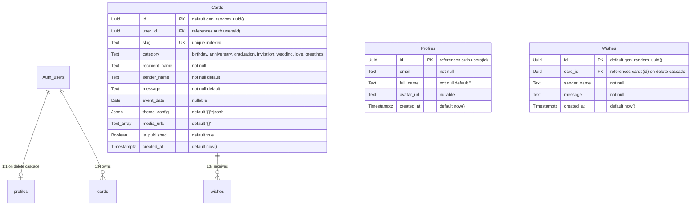
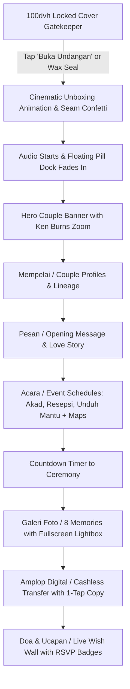
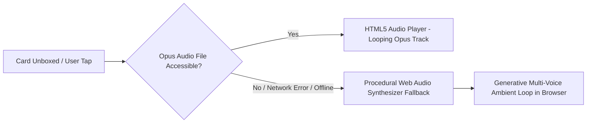

# ElCelebrate — Single Source of Truth & Project Context

> **Repository:** `elcelebrate` (formerly `celebrateloop`)  
> **Audience:** Engineering Leads, Systems Architects, Full-Stack Developers & AI Coding Agents  
> **Document Role:** Authoritative Single Source of Truth (SSOT)  
> **Runtime Environment:** Astro v5 SSR on Cloudflare Pages / Workers (V8 Edge Isolate Runtime)  
> **Last Verified & Audited:** September 2026  

---

## Table of Contents

1. [System Architecture & Tech Stack Summary](#1-system-architecture--tech-stack-summary)
   - 1.1 [Platform Overview](#11-platform-overview)
   - 1.2 [Core Architectural Principles & Zero-Cost Philosophy](#12-core-architectural-principles--zero-cost-philosophy)
   - 1.3 [Technology Stack Matrix](#13-technology-stack-matrix)
   - 1.4 [Configuration Files Specification](#14-configuration-files-specification)
   - 1.5 [Recent Commit History & Evolution](#15-recent-commit-history--evolution)
2. [Database & Storage Specification](#2-database--storage-specification)
   - 2.1 [Relational Schema (Supabase PostgreSQL)](#21-relational-schema-supabase-postgresql)
   - 2.2 [Triggers, Functions & Synchronization](#22-triggers-functions--synchronization)
   - 2.3 [Row Level Security (RLS) Policy Matrix](#23-row-level-security-rls-policy-matrix)
   - 2.4 [`theme_config` JSONB Specification](#24-theme_config-jsonb-specification)
   - 2.5 [Cloudflare R2 Object Storage & Prefix Namespaces](#25-cloudflare-r2-object-storage--prefix-namespaces)
   - 2.6 [Automated Orphaned Asset Garbage Collection](#26-automated-orphaned-asset-garbage-collection)
3. [API Specification & SSR Routing](#3-api-specification--ssr-routing)
   - 3.1 [Authentication Endpoints (`/api/auth`)](#31-authentication-endpoints-apiauth)
   - 3.2 [Cards CRUD Endpoints (`/api/cards`)](#32-cards-crud-endpoints-apicards)
   - 3.3 [Storage & Media Endpoints (`/api/storage`, `/api/media`)](#33-storage--media-endpoints-apistorage-apimedia)
   - 3.4 [Profile Endpoints (`/api/profile`)](#34-profile-endpoints-apiprofile)
   - 3.5 [Wishes & RSVP Endpoints (`/api/wishes`)](#35-wishes--rsvp-endpoints-apiwishes)
4. [Complete Feature Matrix](#4-complete-feature-matrix)
   - 4.1 [Categories Supported (7 Active Types)](#41-categories-supported-7-active-types)
   - 4.2 [Luxury Wedding Invitation Engine](#42-luxury-wedding-invitation-engine)
   - 4.3 [Dual-Engine Background Audio System](#43-dual-engine-background-audio-system)
   - 4.4 [Visual Assets & Cultural Design System](#44-visual-assets--cultural-design-system)
   - 4.5 [Studio Wizard & Live Preview (`/dashboard/create`)](#45-studio-wizard--live-preview-dashboardcreate)
   - 4.6 [Legal & Compliance Pages (`/privacy`, `/terms`)](#46-legal--compliance-pages-privacy-terms)
5. [Active Configuration & Environment Variables](#5-active-configuration--environment-variables)
6. [Current Pending Roadmap & Backlog](#6-current-pending-roadmap--backlog)

---

## 1. System Architecture & Tech Stack Summary

### 1.1 Platform Overview
**ElCelebrate** is an ultra-lightweight, zero-cost-tier digital celebration and greeting card web platform. It enables users to create, customize, preview, manage, and share dynamic interactive greeting cards and luxury long-scroll wedding invitations. The platform features 3D unboxing animations, dual-engine background audio (HTML5 Opus with procedural Web Audio synthesizer fallback), countdown timers, dynamic photo galleries with full-screen lightboxes, digital cash gift envelopes, and public guestbook wish walls with RSVP tracking.

### 1.2 Core Architectural Principles & Zero-Cost Philosophy
The platform is engineered to operate perpetually within the free tiers of modern edge and cloud infrastructure:
1. **Pure Edge SSR:** The application runs on Cloudflare Pages / Workers via Astro v5 in full Server-Side Rendering (`output: 'server'`). Every SSR page and API endpoint executes in the V8 Edge isolate runtime with near-zero cold starts.
2. **Client-Side Heavy Lifting:** Image resizing, downscaling, and WebP transcoding are performed completely inside client Web Workers (`browser-image-compression`). The edge server never ingests raw multi-megabyte image binaries or performs CPU-intensive multipart form parsing.
3. **Direct-to-Storage Uploads:** Clients request cryptographically signed S3 presigned PUT URLs (`/api/storage/presigned-url`) and upload compressed WebP assets directly to Cloudflare R2 object storage.
4. **ISP DNS / SNI Block Immunity (Indonesia & Restricted Regions):** Public `*.r2.dev` domains are frequently blocked or throttled by regional Indonesian ISPs (e.g., Telkomsel, Indihome) due to blanket domain filtering. ElCelebrate solves this via a secure internal edge streaming proxy (`/api/media/[...path]`), which streams media assets directly through the primary application domain with immutable caching headers (`max-age=31536000, immutable`).
5. **Automated Asset Garbage Collection:** Card updates (`PATCH /api/cards/[id]`), card deletions (`DELETE /api/cards/[id]`), and avatar replacements (`POST /api/profile/update`) automatically compute orphaned media keys and delete them permanently from Cloudflare R2 to prevent storage bloat.

### 1.3 Technology Stack Matrix

| Layer | Technology | Exact Version | Configuration & Role |
| :--- | :--- | :--- | :--- |
| **Framework** | [Astro](https://astro.build/) | `^5.2.0` | Content-first web framework operating in full SSR mode (`output: 'server'`). |
| **Edge Adapter** | `@astrojs/cloudflare` | `^12.6.13` | Compiles Astro routes for execution on Cloudflare Pages/Workers V8 isolate runtime. |
| **Styling Engine** | [Tailwind CSS v4](https://tailwindcss.com/) | `^4.0.0` | CSS-first configuration via `@import "tailwindcss";` and `@theme` tokens in `src/styles/global.css`. |
| **Vite Compiler** | `@tailwindcss/vite` | `^4.0.0` | Vite plugin integrating Tailwind v4 directly into Astro's build pipeline. |
| **Static Typing** | TypeScript + `@astrojs/check` | `^5.7.0` / `^0.9.0` | Strict TypeScript checking, JSX runtime definitions, and path aliases. |
| **Database & Auth** | Supabase (`@supabase/supabase-js`, `@supabase/ssr`) | `^2.49.0` / `^0.5.0` | PostgreSQL with Row-Level Security (RLS) & cookie-based SSR session management. |
| **Object Storage** | Cloudflare R2 (`@aws-sdk/client-s3`, `@aws-sdk/s3-request-presigner`) | `^3.700.0` / `^3.700.0` | S3-compatible client for presigned PUT uploads, streaming proxy reads, and deletes. |
| **Client Media** | `browser-image-compression` | `^2.0.2` | Multi-pass downscaling and WebP conversion (≤200KB photos, ≤100KB avatars) in Web Workers. |
| **Visual Effects** | `canvas-confetti` | `^1.9.3` | Dual-stage canvas particle shower triggered upon card unboxing. |
| **Iconography** | `lucide-astro` | `^0.460.0` | Zero-runtime SVG icons for UI actions, navigation, and badges. |
| **CLI & Deploy** | `wrangler` | `^4.131.1` | Cloudflare Workers/Pages CLI deployment and preview toolkit. |

### 1.4 Configuration Files Specification

#### `package.json`
* **Name:** `elcelebrate` (ES Module, `"type": "module"`, Version `1.0.0`)
* **Scripts:**
  * `dev`: `astro dev` — Local development server (port 4321)
  * `build`: `astro build` — Production build targeting Cloudflare adapter
  * `preview`: `astro preview` — Preview production bundle locally
  * `check`: `astro check` — Runs `@astrojs/check` static type audits
  * `start`: `astro dev` — Alias for `dev`

#### `astro.config.mjs`
```javascript
import { defineConfig, passthroughImageService } from 'astro/config';
import cloudflare from '@astrojs/cloudflare';
import tailwindcss from '@tailwindcss/vite';

export default defineConfig({
  output: 'server',
  adapter: cloudflare({
    imageService: 'passthrough',
  }),

  image: {
    service: passthroughImageService(),
  },

  Vite: {
    Plugins: [tailwindcss()],
    Resolve: {
      Alias: {
        '@components': '/src/components',
        '@lib': '/src/lib',
        '@styles': '/src/styles',
      },
    },
  },
});
```

#### `wrangler.toml`
```toml
Name = "elcelebrate"
Compatibility_date = "2025-01-01"

[assets]
Directory = "./dist/_astro"
```

#### `tsconfig.json`
```json
{
  "extends": "./node_modules/astro/tsconfigs/strict.json",
  "compilerOptions": {
    "baseUrl": ".",
    "paths": {
      "@components/*": ["src/components/*"],
      "@lib/*": ["src/lib/*"],
      "@styles/*": ["src/styles/*"]
    },
    "jsx": "react-jsx",
    "jsxImportSource": "react"
  }
}
```

### 1.5 Recent Commit History & Evolution

| Commit Hash | Type / Scope | Description & Architectural Impact |
| :--- | :--- | :--- |
| `8bd5ca6` | `feat` | Enhance wedding experience, 11-photo slot architecture, cultural ornaments, and 7-track audio catalog. |
| `42ba333` | `feat` | Add authentic cultural ambient effects (`jasmine`, `beras-kuning`, `keraton-glow`), 9 SVG patterns, and share modal. |
| `6d8177c` | `feat` | Update brand identity, midnight gold theme tokens, and card share modal. |
| `01341d9` | `feat` | Brand logo update, midnight gold palette refinements, and universal share modal. |
| `f20d700` | `fix` | Apply mobile layout fixes, audio button touch targets, and backend audit resolutions. |
| `2aaf915` | `fix` | Import `global.css` properly in layout frontmatter across SSR templates. |
| `1487413` | `fix` | Sync `@cloudflare/workers-types` in lockfile. |
| `8b85d98` | `chore` | Configure Cloudflare Pages adapter for Astro v5 SSR. |
| `2df6136` | `feat` | Fix countdown NaN edge cases, enforce wedding photo slots, add Unduh Mantu schedules, unify scroll animations. |
| `19f2664` | `feat` | Polish wedding typography contrast, dynamic wish button, and cinematic gallery reveal. |
| `080267f` | `feat` | Add wedding category, fix card edit flow, and add project overview documentation. |
| `851e53d` | `feat` | Edit, Delete, Toggle Publish with R2 Asset Cleanup and rebrand platform to ElCelebrate with UI polish. |
| `f42bca4` | `feat` | Initial commit: Core MVP with auth, R2 media proxy, and card studio. |

---

## 2. Database & Storage Specification

The database layer is hosted on Supabase PostgreSQL with strict Row Level Security (RLS) enabled across every table.


```mermaid
erDiagram
    Auth_users ||--o| profiles : "1:1 on delete cascade"
    Auth_users ||--o{ cards : "1:N owns"
    Cards ||--o{ wishes : "1:N receives"

    Profiles {
        Uuid id PK "references auth.users(id)"
        Text email "not null"
        Text full_name "not null default ''"
        Text avatar_url "nullable"
        Timestamptz created_at "default now()"
    }

    Cards {
        Uuid id PK "default gen_random_uuid()"
        Uuid user_id FK "references auth.users(id)"
        Text slug UK "unique indexed"
        Text category "birthday, anniversary, graduation, invitation, wedding, love, greetings"
        Text recipient_name "not null"
        Text sender_name "not null default ''"
        Text message "not null default ''"
        Date event_date "nullable"
        Jsonb theme_config "default '{}'::jsonb"
        Text_array media_urls "default '{}'"
        Boolean is_published "default true"
        Timestamptz created_at "default now()"
    }

    Wishes {
        Uuid id PK "default gen_random_uuid()"
        Uuid card_id FK "references cards(id) on delete cascade"
        Text sender_name "not null"
        Text message "not null"
        Timestamptz created_at "default now()"
    }
```

### 2.1 Relational Schema (Supabase PostgreSQL)

#### `public.profiles`
Created automatically via database trigger upon registration in `auth.users`.
* `id` (`uuid`, Primary Key): References `auth.users(id)` `ON DELETE CASCADE`.
* `email` (`text`, Not Null): User email address.
* `full_name` (`text`, Not Null, Default `''`): Display name of the user.
* `avatar_url` (`text`, Nullable): Path or URL to the user avatar (stored under `avatars/{userId}/...` in R2 and proxied via `/api/media/`).
* `created_at` (`timestamptz`, Not Null, Default `now()`).

#### `public.cards`
Core entity representing celebration cards and wedding invitations.
* `id` (`uuid`, Primary Key, Default `gen_random_uuid()`): Unique card record identifier.
* `user_id` (`uuid`, Not Null, Foreign Key): References `auth.users(id)` `ON DELETE CASCADE`. Indexed via `idx_cards_user_id`.
* `slug` (`text`, Unique, Not Null): URL-safe public path (e.g., `sarah-alex-wedding-k9x2`). Indexed via `idx_cards_slug`.
* `category` (`text`, Not Null): Supported types: `birthday`, `anniversary`, `graduation`, `invitation`, `wedding`, `love`, `greetings`.
* `recipient_name` (`text`, Not Null): Recipient or couple display title.
* `sender_name` (`text`, Not Null, Default `''`): Creator or host signature name.
* `message` (`text`, Not Null, Default `''`): Personal message or opening narrative.
* `event_date` (`date`, Nullable): Milestone date for countdown calculation (`YYYY-MM-DD`).
* `theme_config` (`jsonb`, Not Null, Default `'{}'::jsonb`): Stores visual styles, animations, ambient effects, audio settings, and category-specific structured metadata.
* `media_urls` (`text[]`, Default `'{}'`): Array of photo URLs (proxied `/api/media/cards/...` or direct URLs). Maximum 11 photos for `wedding`, 4 photos for other categories.
* `is_published` (`boolean`, Default `true`): Controls public visibility of the card.
* `created_at` (`timestamptz`, Not Null, Default `now()`).

#### `public.wishes`
Guestbook messages and RSVP submissions attached to specific cards.
* `id` (`uuid`, Primary Key, Default `gen_random_uuid()`): Unique wish identifier.
* `card_id` (`uuid`, Not Null, Foreign Key): References `public.cards(id)` `ON DELETE CASCADE`. Indexed via `idx_wishes_card_id`.
* `sender_name` (`text`, Not Null): Name of the guest posting the wish.
* `message` (`text`, Not Null): Content of the wish (may include RSVP prefix `[✅ Hadir]` or `[🙏 Berhalangan]`).
* `created_at` (`timestamptz`, Not Null, Default `now()`).

### 2.2 Triggers, Functions & Synchronization
From `supabase/migrations/001_initial_schema.sql` and `002_add_avatar_url_to_profiles.sql`:
* **Function:** `public.handle_new_user()` (`SECURITY DEFINER`, `plpgsql`):
  Fires after an insert into `auth.users`. Inserts or updates `public.profiles` with `id`, `email`, `full_name` (coalesced from `raw_user_meta_data->>'full_name'`), and `avatar_url` (from `raw_user_meta_data->>'avatar_url'`). Includes `ON CONFLICT (id) DO UPDATE` to keep profile records synchronized.
* **Trigger:** `on_auth_user_created`:
  `AFTER INSERT ON auth.users FOR EACH ROW EXECUTE PROCEDURE public.handle_new_user();`

### 2.3 Row Level Security (RLS) Policy Matrix

| Table | Operation | Policy Name | Permitted Actor | Expression / Condition |
| :--- | :--- | :--- | :--- | :--- |
| `profiles` | `SELECT` | "Users can view own profile" | Authenticated Owner | `auth.uid() = id` |
| `profiles` | `UPDATE` | "Users can update own profile" | Authenticated Owner | `auth.uid() = id` |
| `cards` | `SELECT` | "Public can view published cards" | Anyone (Public) | `is_published = true` |
| `cards` | `SELECT` | "Owners can view all own cards" | Authenticated Owner | `auth.uid() = user_id` |
| `cards` | `INSERT` | "Authenticated users can create cards" | Authenticated User | `with check (auth.uid() = user_id)` |
| `cards` | `UPDATE` | "Owners can update own cards" | Authenticated Owner | `using (auth.uid() = user_id)` |
| `cards` | `DELETE` | "Owners can delete own cards" | Authenticated Owner | `using (auth.uid() = user_id)` |
| `wishes` | `SELECT` | "Public can view wishes for published cards" | Anyone (Public) | `EXISTS (SELECT 1 FROM public.cards WHERE cards.id = wishes.card_id AND cards.is_published = true)` |
| `wishes` | `INSERT` | "Anyone can submit wishes" | Anyone (Public) | `WITH CHECK (EXISTS (SELECT 1 FROM public.cards WHERE cards.id = wishes.card_id AND cards.is_published = true))` |
| `wishes` | `DELETE` | "Card owners can delete wishes" | Authenticated Card Owner | `EXISTS (SELECT 1 FROM public.cards WHERE cards.id = wishes.card_id AND cards.user_id = auth.uid())` |

### 2.4 `theme_config` JSONB Specification

The `theme_config` JSONB column stores visual, audio, and category-specific parameters:

```typescript
export interface ThemeConfig {
  // Visual Theme Tokens
  PrimaryColor: string;       // Hex color (e.g., "#f5c563")
  SecondaryColor: string;     // Hex color (e.g., "#e07a93")
  BackgroundColor: string;    // Hex color (e.g., "#0f0d15")
  FontFamily: 'serif' | 'sans' | 'handwritten' | 'display';
  BackgroundPattern: 'none' | 'kawung' | 'truntum' | 'megamendung' | 'songket' | 'pucukrebung' | 'parang' | 'tenun' | 'damask' | 'arabesque' | 'constellation';
  UnboxStyle: 'envelope' | 'giftbox' | 'ribbon';

  // Audio Configuration
  AudioTrackId: string | null;      // Pre-bundled track ID ('wedding', 'birthday', etc.)
  ExternalAudioUrl: string | null;  // Direct audio stream URL
  CustomAudioUrl?: string | null;   // Proxied user-uploaded R2 audio URL

  // Ambient & Cultural Ornaments
  AmbientEffect?: 'none' | 'petals' | 'golden-sparkles' | 'hearts' | 'confetti-float' | 'starlight' | 'lanterns' | 'butterflies' | 'bokeh' | 'sparklers' | 'snowfall' | 'hearts-petals' | 'jasmine' | 'beras-kuning' | 'keraton-glow' | 'fireflies';
  CornerOrnament?: 'none' | 'botanical' | 'keraton' | 'melati' | 'pucukrebung' | 'artdeco';
  UnboxingStyle?: 'gate-split' | 'curtain-lift' | 'wax-seal' | string;

  // Wedding-Specific Data (Active when category === 'wedding')
  WeddingHeaderTitle?: string;      // e.g. "Walimatul 'Urs" or "The Wedding of"
  WeddingData?: {
    Bride: { fullName: string; nickname: string; parents: string };
    Groom: { fullName: string; nickname: string; parents: string };
    AkadEvent: WeddingEventDetail;
    ReceptionEvent: WeddingEventDetail;
    UnduhMantu?: {
      Enabled: boolean;
      Title?: string;
      Date?: string;
      Time?: string;
      LocationName?: string;
      Address?: string;
      MapUrl?: string;
    };
    DigitalEnvelope: { bankName: string; accountNumber: string; accountHolder: string };
    LoveStory: string;
    OpeningGreeting: string;
  };

  // Love & Confession Specific
  Passcode?: string;                 // 4-digit PIN for locked letter
  InteractiveConfession?: {
    Enabled: boolean;
    Prompt?: string;
    YesText?: string;
    NoText?: string;
  };

  // Holiday & Greetings Specific
  Occasion?: 'idul-fitri' | 'natal-tahun-baru' | 'hari-ibu-ayah' | 'general' | string;
  Signature?: string;

  // Milestones & Extra Badges
  AgeMilestone?: string;             // Birthday
  AnniversaryMilestone?: string;     // Anniversary
  DegreeMajor?: string;              // Graduation
  SchoolCampus?: string;             // Graduation
  InvitationEventType?: string;      // Invitation
  InvitationTime?: string;           // Invitation
  InvitationVenue?: string;          // Invitation
}
```

### 2.5 Cloudflare R2 Object Storage & Prefix Namespaces

All user-generated media files reside in Cloudflare R2 (`elcelebrate-assets` bucket) and are segregated by namespace prefix:
* **Cards Media:** `cards/{userId}/{timestamp}-{filename}.webp`
* **User Avatars:** `avatars/{userId}/{timestamp}-{filename}.webp`
* **Custom Audio:** `audio/{userId}/{timestamp}-{random}.{ext}` (`.mp3`, `.ogg`, `.opus`)

### 2.6 Automated Orphaned Asset Garbage Collection

To prevent storage bloat and costs:
1. **Card Update (`PATCH /api/cards/[id]`):** Compares the submitted `media_urls` and `theme_config.customAudioUrl` against existing database records. Any previously referenced keys that are absent in the updated payload are deleted via `deleteR2Object()`.
2. **Card Deletion (`DELETE /api/cards/[id]`):** Fetches the card record before deletion, extracts all R2 keys from `media_urls` and `customAudioUrl`, and deletes all physical objects from Cloudflare R2 in parallel via `Promise.allSettled()`.
3. **Avatar Update (`POST /api/profile/update`):** Compares new `avatar_url` with the existing avatar in `public.profiles`. If changed or removed, extracts the old key and deletes it from R2.

---

## 3. API Specification & SSR Routing

All endpoints are hosted under `/api/` and operate in SSR mode (`export const prerender = false`). Responses use standard JSON schemas and adhere to RESTful status codes.

### 3.1 Authentication Endpoints (`/api/auth`)

| Endpoint | Method | Auth | Payload | Behavior & Response |
| :--- | :--- | :--- | :--- | :--- |
| `/api/auth/login` | `POST` | None | `{ email, password }` | Authenticates via Supabase Auth, sets `sb-access-token` (session expiry) & `sb-refresh-token` (7 days) as `HttpOnly`, `SameSite=Lax` cookies. Returns `{ user, session }`. |
| `/api/auth/signup` | `POST` | None | `{ email, password, full_name }` | Registers user, stores `full_name` in user metadata (triggering profile creation), sets session cookies. Returns 201 Created. |
| `/api/auth/magic-link` | `POST` | None | `{ email }` | Triggers Supabase passwordless OTP magic link email pointing to `/api/auth/callback`. Returns `{ message: 'Magic link sent' }`. |
| `/api/auth/callback` | `GET` | None | Query: `?code=...` | Exchanges PKCE code for session, sets session cookies, and redirects (302) to `/dashboard`. |
| `/api/auth/logout` | `POST` | Session | None | Calls `supabase.auth.signOut()`, deletes session cookies, and redirects (302) to `/`. |

### 3.2 Cards CRUD Endpoints (`/api/cards`)

| Endpoint | Method | Auth | Parameters / Body | Description & Constraints |
| :--- | :--- | :--- | :--- | :--- |
| `/api/cards` | `GET` | Required | None | Lists all cards owned by the authenticated user, ordered by `created_at DESC`. Automatically resolves media URLs through `/api/media/`. |
| `/api/cards` | `POST` | Required | `{ category, recipient_name, sender_name, message, event_date, theme_config, media_urls }` | Validates category (7 active categories), enforces photo limits (max 11 for `wedding`, max 4 for others), auto-generates collision-resistant slug, sanitizes media URLs. Returns 201 Created. |
| `/api/cards/[id]` | `GET` | Public/Auth | Path: `id` | Fetches a single card by ID with resolved media URLs. |
| `/api/cards/[id]` | `PATCH` | Required (Owner) | Partial mutable card fields | Updates permitted mutable fields (`is_published`, `recipient_name`, `sender_name`, `message`, `event_date`, `theme_config`, `media_urls`). Validates photo limits and performs automated R2 orphaned asset garbage collection. |
| `/api/cards/[id]` | `DELETE` | Required (Owner) | Path: `id` | Permanently deletes all physical media files and custom audio from R2, then deletes the database row (cascades to delete all wishes). |
| `/api/cards/by-slug/[slug]` | `GET` | None (Public) | Path: `slug` | Fetches a published card by slug for public viewing. Returns 404 if not found or unpublished. |

### 3.3 Storage & Media Endpoints (`/api/storage`, `/api/media`)

#### `POST /api/storage/presigned-url`
* **Authentication:** Required.
* **Request Body:** `{ filename: string, contentType: string, folder?: 'cards' | 'avatars' | 'audio' }`
* **Validation & Security:**
  * For images (`cards`, `avatars`): Extension must be `.webp` and content type `image/webp`.
  * For audio (`audio`): Extension must be `.mp3`, `.ogg`, or `.opus` with corresponding MIME types (`audio/mpeg`, `audio/ogg`, `audio/opus`).
  * Generates unique key: `{folder}/{userId}/{timestamp}-{filename}`.
* **Response:** `{ uploadUrl, publicUrl: '/api/media/{key}', key }` (valid for 300 seconds).

#### `GET /api/media/[...path]` & `HEAD /api/media/[...path]`
* **Authentication:** None (Public edge streaming proxy).
* **Security Guards:**
  * Strict path traversal prevention: Rejects any path containing `..` or `\`.
  * Prefix whitelist: Must start with `cards/`, `avatars/`, or `audio/`.
* **Streaming & Caching:**
  * Streams raw object from R2 via `transformToWebStream()`.
  * Sets headers: `Content-Type`, `Accept-Ranges: bytes`, `Cache-Control: public, max-age=31536000, immutable`, `Content-Length`, `ETag`.

### 3.4 Profile Endpoints (`/api/profile`)

#### `POST /api/profile/update`
* **Authentication:** Required.
* **Request Body:** `{ full_name: string, avatar_url?: string }`
* **Behavior:** Updates `public.profiles`, synchronizes `auth.users` metadata so the active session immediately reflects changes, and deletes any replaced avatar from R2.

### 3.5 Wishes & RSVP Endpoints (`/api/wishes`)

#### `GET /api/wishes/[cardId]`
* **Authentication:** None (Public).
* **Behavior:** Returns all wishes for the specified card ordered by `created_at DESC`.

#### `POST /api/wishes/[cardId]`
* **Authentication:** None (Public guestbook).
* **Request Body:** `{ sender_name: string, message: string }`
* **Validation:** `sender_name` (1-100 chars), `message` (1-500 chars), card must exist and have `is_published = true`. Returns 201 Created.

---

## 4. Complete Feature Matrix

### 4.1 Categories Supported (7 Active Types)

| Category Key | Label & Emoji | Unique Feature Set | Photo Limit |
| :--- | :--- | :--- | :--- |
| `birthday` | Birthday 🎂 | Age milestone badge, celebratory confetti blaster, giftbox/envelope unboxing, birthday audio. | 4 photos |
| `anniversary` | Anniversary 💍 | Anniversary milestone years, romantic dual-tone gradients, sweet milestone audio loop. | 4 photos |
| `graduation` | Graduation 🎓 | Degree/major, school/campus metadata, celebratory starlight ambient particles, triumphant audio. | 4 photos |
| `invitation` | Invitation ✉️ | Event type, time, and venue details, calendar RSVP, golden sparkles ambient effect. | 4 photos |
| `wedding` | Wedding Invitation 💍 | Full Zehan luxury long-scroll invitation: 11-slot photo architecture, 3 unboxing animations, couple profiles, Akad/Resepsi/Unduh Mantu schedules, Google Maps integration, countdown timer, mist gallery, digital envelope, live wish wall. | 11 photos |
| `love` | Love Letter & Confession 💌 | 4-digit PIN passcode gate before opening (with visual numpad & error shake), interactive confession prompt with dodging/persuading buttons ("Will you be mine?"), tender romance audio. | 4 photos |
| `greetings` | Holiday & Greetings 🌙 | Occasion picker (`idul-fitri`, `natal-tahun-baru`, `hari-ibu-ayah`, `general`), seasonal ambient effects (lanterns, snowfall), heartfelt signature. | 4 photos |

### 4.2 Luxury Wedding Invitation Engine

When `category === 'wedding'`, the recipient route (`/c/[slug]`) activates a high-density, editorial long-scroll wedding experience:


```mermaid
flowchart TD
    A[100dvh Locked Cover Gatekeeper] -->|Tap 'Buka Undangan' or Wax Seal| B[Cinematic Unboxing Animation & Seam Confetti]
    B --> C[Audio Starts & Floating Pill Dock Fades In]
    C --> D[Hero Couple Banner with Ken Burns Zoom]
    D --> E[Mempelai / Couple Profiles & Lineage]
    E --> F[Pesan / Opening Message & Love Story]
    F --> G[Acara / Event Schedules: Akad, Resepsi, Unduh Mantu + Maps]
    G --> H[Countdown Timer to Ceremony]
    H --> I[Galeri Foto / 8 Memories with Fullscreen Lightbox]
    I --> J[Amplop Digital / Cashless Transfer with 1-Tap Copy]
    J --> K[Doa & Ucapan / Live Wish Wall with RSVP Badges]
```

#### 1. 11-Slot Photo Architecture
* **Slot 1 (`media_urls[0]`):** Cover & Hero Couple Portrait (featured on 100dvh cover and top hero banner with Ken Burns ambient zoom).
* **Slot 2 (`media_urls[1]`):** Bride Profile Portrait (circular bordered photo with gold ring).
* **Slot 3 (`media_urls[2]`):** Groom Profile Portrait (circular bordered photo with gold ring).
* **Slots 4–11 (`media_urls[3..10]`):** 8 Gallery Memories ("OUR SWEET MOMENTS") displayed in a romantic mist grid with individual milestone badges ("Momen 1 ✨" to "Momen 8 ✨") and click-to-expand full-screen lightbox modal.

#### 2. Cinematic Unboxing Animations
1. **`gate-split` (Royal Double Doors):** Lateral sliding doors with realistic inner door thickness shadows (`box-shadow: inset -22px 0 38px -10px rgba(0,0,0,0.88)`), golden center seam glow pulse (`seam-gold-pulse`), and micro-feedback button press.
2. **`curtain-lift`:** Full-screen backdrop blur dissolve (`backdrop-filter: blur(16px)` to `0px`) with stately upward gliding curtain.
3. **`wax-seal`:** Symmetrical royal wax seal envelope featuring an interactive gold medallion (`👑`) with breathing glow pulse (`wax-seal-glow-pulse`). On click, the seal shatters and rotates outward (`wax-seal-broken`) as the top 3D envelope flap rotates $180^\circ$ backwards in perspective (`rotateX(-180deg)`), unlocking the long scroll.

#### 3. Orchestrated Section Scroll Choreography
* Powered by `IntersectionObserver` observing `.wedding-reveal` elements.
* Choreographed CSS stagger classes:
  * `.reveal-hero`: Scale settle from `1.08` to `1.0` followed by continuous Ken Burns float.
  * `.reveal-heading`: Champagne divider line expansion with soft fade-in.
  * `.reveal-portrait`: Staggered slide-in of bride and groom cards.
  * `.reveal-card`: Smooth upward glide with blur removal.
  * `.reveal-gallery-item`: Cascading delay (`calc(index * 75ms)`) revealing moments sequentially.

#### 4. Floating Pill Navigation Dock
* Glassmorphic pill bar (`fixed bottom-4 left-1/2 -translate-x-1/2 z-40`) with backdrop blur.
* Navigation anchors:
  * 💑 Mempelai (`#mempelai`)
  * 📅 Acara (`#acara`)
  * ⏳ Hitung Mundur (`#countdown`)
  * 🖼️ Galeri (`#galeri`)
  * 🎁 Amplop Digital (`#amplop`)
  * 💬 Doa & Ucapan (`#doa`)
* Active section indicator updates dynamically via scroll spy.

#### 5. Animated Cultural Corner Ornaments
Custom SVG corner ornaments anchored to all four corners of the recipient card with subtle CSS breeze-float and pulse animations:
1. `keraton` (🏛️): Intricate royal Javanese/Jepara carved floral scroll motif.
2. `melati` (🤍): Sacred wedding ronce melati jasmine garland & sirih leaf motifs with gentle breathing pulse.
3. `pucukrebung` (🎋): Traditional Minangkabau chevron corner brocade.
4. `botanical` (🌿): Organic drifting leafy branches with gentle wind sway.
5. `artdeco` (⚜️): Symmetrical luxury Gatsby geometric gold lines.
6. `none`: Minimalist edge without corner ornaments.

### 4.3 Dual-Engine Background Audio System


```mermaid
flowchart LR
    A[Card Unboxed / User Tap] --> B{Opus Audio File Accessible?}
    B -->|Yes| C[HTML5 Audio Player - Looping Opus Track]
    B -->|No / Network Error / Offline| D[Procedural Web Audio Synthesizer Fallback]
    D --> E[Generative Multi-Voice Ambient Loop in Browser]
```

#### 1. 7 Category-Curated Opus Audio Tracks
Pre-bundled in `public/audio/` (< 2MB each, optimized for mobile streaming):
* `wedding.opus` — **Sacred Romance** (58s, Sacred & Romantic, tailored for `wedding`, `anniversary`, `love`)
* `birthday.opus` — **Birthday Joy** (44s, Joyful & Festive, tailored for `birthday`, `invitation`, `greetings`)
* `anniversary.opus` — **Sweet Milestone** (50s, Warm & Nostalgic, tailored for `anniversary`, `love`, `wedding`)
* `graduation.opus` — **Triumphant Horizon** (60s, Inspiring & Grand, tailored for `graduation`, `invitation`)
* `invitation.opus` — **Celebration Vibe** (48s, Upbeat & Welcoming, tailored for `invitation`, `birthday`, `graduation`)
* `love.opus` — **Heartfelt Melody** (54s, Intimate & Tender, tailored for `love`, `wedding`, `anniversary`)
* `greetings.opus` — **Warm Wishes** (46s, Peaceful & Cordial, tailored for `greetings`, `birthday`, `invitation`)

*Includes `LEGACY_TRACK_MAP` for backward compatibility with existing saved cards.*

#### 2. Zero-Dependency Procedural Web Audio Synthesizer (`src/lib/synth-audio.ts`)
* Acts as a resilient zero-cost fallback when network fails or audio files are blocked.
* Generates music dynamically via native Web Audio API (`AudioContext`).
* **5 Instrument Voices:**
  * `piano`: Rhodes electric piano with warm dual-sine modulation.
  * `strings`: Polyphonic saw-wave orchestral pads with lowpass filtering.
  * `bells`: Glockenspiel and music box chimes with high harmonic decay.
  * `pluck`: Acoustic harp/guitar plucks with fast exponential envelopes.
  * `bass`: Warm sub-bass tones grounding chord progressions.
* **Lookahead Scheduler:** Runs a 25ms interval timer scheduling notes 120ms ahead of time to eliminate timing jitter and micro-stuttering.
* **Interactive Vinyl Widget:** Floating spinning vinyl disc button with rising musical note particles (`♪`, `♫`, `♩`) indicating playback status.

### 4.4 Visual Assets & Cultural Design System

#### 1. Authentic Cultural Seamless SVG Patterns
Integrated in `src/styles/global.css` and dynamically injected in `c/[slug].astro` using the card's chosen `primaryColor` and `secondaryColor`:
* `kawung`: Sacred Javanese geometric ellipses symbolizing purity and justice.
* `truntum`: Delicate star-flower motif symbolizing unconditional, blossoming love.
* `megamendung`: Cirebon cloud waves symbolizing tranquility and patience.
* `songket`: Traditional Minangkabau diamond brocade representing nobility.
* `pucukrebung`: Bamboo shoot chevrons representing continuous growth and prosperity.
* `parang`: Slanted warrior wave blade pattern representing determination.
* `tenun`: Geometric cross-stitch woven textile textures.
* `damask`: Ornate Victorian / Baroque floral medallion damask.
* `arabesque`: Symmetrical Islamic interlaced geometric stars.
* `constellation`: Ambient starry sky lines and celestial coordinates.

#### 2. Ambient Particle Canvas Engine (`src/components/ui/AmbientEffect.astro`)
High-performance HTML5 Canvas particle system running at 60 FPS on mobile GPUs via offscreen sprite rendering:
* `jasmine`: Authentic 8-pointed ivory-white jasmine flowers (`#ffffff` to amber-lime `#eef6d8` center) drifting with 3D roll and pitch.
* `beras-kuning`: Slender golden rice grains with metallic gleam highlights and 3D tumbling physics.
* `keraton-glow`: Rising champagne gold embers with radial halos.
* `confetti-float`: Multicolored celebration paper confetti with flutter sway.
* `petals`: Velvety crimson rose petals with curved Bézier contours.
* Additional effects: `hearts`, `starlight`, `lanterns`, `butterflies`, `bokeh`, `sparklers`, `snowfall`, `hearts-petals`, `fireflies`.
* Battery-saving: Automatically pauses rendering loop when the browser tab is hidden (`document.visibilityState === 'hidden'`).

### 4.5 Studio Wizard & Live Preview (`/dashboard/create`)

The Card Studio wizard provides a unified interface for creating and editing cards (`/dashboard/create` and `/dashboard/create?edit=[id]`):
* **Step 1: Category Selection:** Visual cards for all 7 categories with auto-applied smart defaults for themes and music.
* **Step 2: Theme & Styling:**
  * 5 Quick Color Palettes: **Midnight Gold** (`#f5c563` / `#e07a93`), **Romantic Rose** (`#e07a93` / `#f4a261`), **Emerald Luxury** (`#2a9d8f` / `#e76f51`), **Ocean Twilight** (`#4a90e2` / `#9b51e0`), and **Classic Gold** (`#d4af37` / `#2b2523`).
  * Custom hex color pickers for primary, secondary, and background colors.
  * 4 typography choices (`display`, `serif`, `sans`, `handwritten`).
  * Seamless cultural background pattern selector with visual preview swatches.
  * Unboxing animation style selector (`gate-split`, `curtain-lift`, `wax-seal` for wedding; `envelope`, `giftbox`, `ribbon` for standard).
  * Ambient particle effects and corner ornament pickers.
  * Audio track selector with in-studio audio preview player.
* **Step 3: Media Upload:**
  * Drag-and-drop file upload zone.
  * Client-side Web Worker image compression with progress bars.
  * Context-aware slot mapping: For weddings, clearly designates Slot 1 (Cover), Slot 2 (Bride), Slot 3 (Groom), and Slots 4–11 (Gallery Memories).
* **Step 4: Content & Event Details:**
  * Dynamic form fields reflecting the chosen category.
  * For weddings: Bride & groom details, parents, Akad & Resepsi event times/venues, optional Unduh Mantu schedules, Google Maps URLs, digital cash envelope bank info, and love story.
  * For love cards: 4-digit secret PIN code and interactive confession toggles.
  * For greetings cards: Occasion dropdown (`idul-fitri`, `natal-tahun-baru`, `hari-ibu-ayah`, `general`).
* **Step 5: Review & Publish:**
  * Summary review of card settings with publish toggle.
  * Generates instant public sharing link (`/c/{slug}`) and universal share modal (WhatsApp, Telegram, X, Facebook, and Native Web Share API).
* **Interactive Live Phone Preview:** Real-time phone frame on the right side of the screen updating instantaneously as inputs are modified.

### 4.6 Legal & Compliance Pages (`/privacy`, `/terms`)

Dedicated, comprehensive legal pages built with Astro SSR and Midnight Velvet styling:
* **`/privacy` (Kebijakan Privasi):** Covers user account protection, RLS enforcement, physical asset deletion guarantees on Cloudflare R2, digital envelope financial disclaimers, and visitor wish wall data retention.
* **`/terms` (Syarat & Ketentuan Layanan):** Outlines permitted platform use, user media copyright indemnification, digital envelope transaction disclaimers, service availability on edge infrastructure, and account termination policies.

---

## 5. Active Configuration & Environment Variables

### 5.1 Port & Runtime
* **Local Development:** `http://localhost:4321` via `astro dev` (or `npm run dev`)
* **Production Runtime:** Cloudflare Pages / Workers V8 Edge Runtime via `@astrojs/cloudflare`
* **Static Assets:** Served via Cloudflare asset bindings from `./dist/_astro`

### 5.2 Environment Variables Matrix

| Variable Name | Exposure | Required | Purpose |
| :--- | :--- | :--- | :--- |
| `PUBLIC_SUPABASE_URL` | Public / Client | Yes | Supabase project API gateway URL. |
| `PUBLIC_SUPABASE_ANON_KEY` | Public / Client | Yes | Supabase anon public API key (restricted by RLS). |
| `SUPABASE_SERVICE_ROLE_KEY` | Server-Only | Yes | Supabase administrative key (bypasses RLS for secure admin tasks). |
| `R2_ACCOUNT_ID` | Server-Only | Yes | Cloudflare account identifier for S3 API endpoint. |
| `R2_ACCESS_KEY_ID` | Server-Only | Yes | Cloudflare R2 API token access key ID. |
| `R2_SECRET_ACCESS_KEY` | Server-Only | Yes | Cloudflare R2 API token secret access key. |
| `R2_BUCKET_NAME` | Server-Only | Yes | Cloudflare R2 target bucket name (`elcelebrate-assets`). |
| `R2_PUBLIC_DOMAIN` | Server-Only | Optional | Custom R2 domain if configured (internal proxy handles edge routing). |

### 5.3 Security Headers & Edge Policy
* **Media Proxy (`/api/media/[...path]`):**
  * `Cache-Control: public, max-age=31536000, immutable`
  * Strict path traversal guard (`..` and `\` rejected with 403 Forbidden).
  * Namespace whitelist restricted to `cards/`, `avatars/`, and `audio/`.
* **Cookie Policy:**
  * `sb-access-token`: `HttpOnly`, `SameSite=Lax`, `Path=/`, `Secure` (in production).
  * `sb-refresh-token`: `HttpOnly`, `SameSite=Lax`, `Path=/`, `Secure` (in production), 7-day max-age.

---

## 6. Current Pending Roadmap & Backlog

| Feature / Task | Area | Current Status | Next Action / Implementation Plan |
| :--- | :--- | :--- | :--- |
| **Custom Audio Upload ($\le 3$MB)** | Storage & Audio | **Backend Complete** / UI Pending | Storage presigned URL endpoint (`POST /api/storage/presigned-url`) and media proxy (`/api/media/[...path]`) already support `folder === 'audio'` with MIME validation (`.mp3`, `.ogg`, `.opus`). **Next:** Add file upload trigger to Step 2 audio selector in `create.astro` to allow creators to upload personal songs directly to R2. |
| **Quick Color Swatches (Step 2)** | Studio Wizard | **Completed** | 5 curated dual-pill palettes (**Midnight Gold**, **Romantic Rose**, **Emerald Luxury**, **Ocean Twilight**, **Classic Gold**) are fully implemented and active in `create.astro`. **Next:** Allow users to save custom palette combinations to their browser local storage. |
| **`/privacy` & `/terms` Legal Pages** | Legal & Compliance | **Completed** | Full dark-mode legal documentation implemented in `src/pages/privacy.astro` and `src/pages/terms.astro` with table of contents and last updated indicators. |
| **Non-Wedding Category Refinements** | Templates & Recipient | In Progress | Standard cards share a responsive recipient layout. **Next:** Build dedicated layouts for Baby Shower, Aqiqah, and Corporate Gala milestone cards with category-specific unboxing animations and custom metadata schemas. |
| **Dynamic EMVCo QRIS Gifting** | Wedding Engine | Planned | Extend `WeddingDigitalEnvelope` to support dynamic QRIS generation (payload rendering or image upload) to complement bank transfer details in the `#amplop` section. |
| **Internationalization (i18n)** | Core Platform | Planned | Add bilingual locale toggle (`id` / `en`) in `ThemeConfig` to support English wedding invitations and greeting cards with localized date formatting via `Intl.DateTimeFormat`. |
