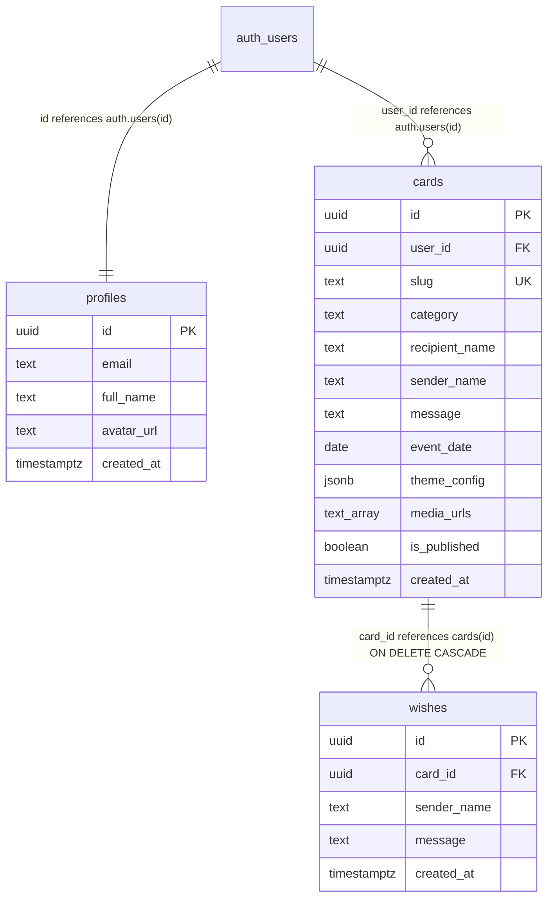
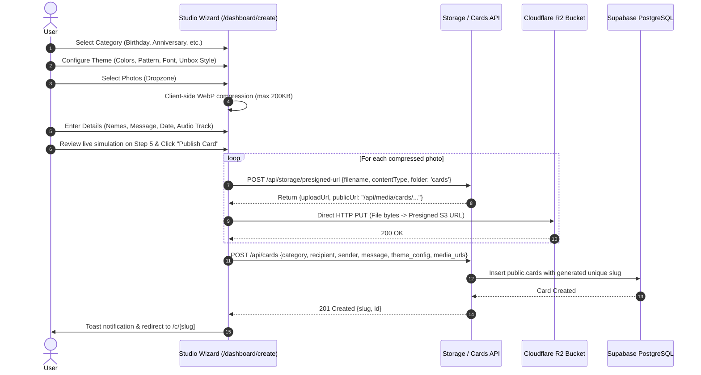
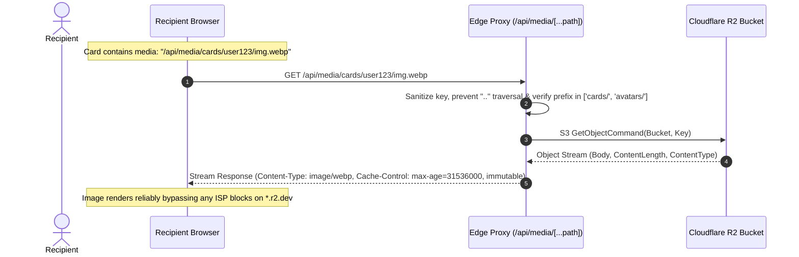
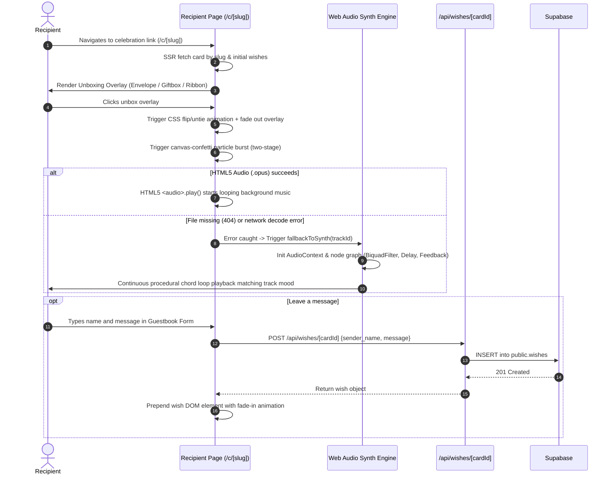

# ElCelebrate — Comprehensive Architecture & Project Overview

> **Repository:** `elcelebrate`  
> **Documentation Type:** Technical Architecture, Feature Inventory & System Workflows  
> **Status:** Grounded to Current Codebase  

---

## 1. Executive Summary & Tech Stack

### 1.1 Platform Overview & Value Proposition
**ElCelebrate** is an ultra-lightweight, zero-cost-tier digital celebration and greeting card web platform. It empowers users to design, customize, preview, and share responsive digital cards featuring animations, music, countdown timers, photo galleries, and guestbooks (Wish Walls) for milestones like **birthdays**, **anniversaries**, **graduations**, and **event invitations**.

#### Core Architectural Highlights
* **Zero-Cost Edge Infrastructure:** Runs on Cloudflare Pages / Workers SSR using free-tier services ([Supabase](https://supabase.com) PostgreSQL and [Cloudflare R2](https://www.cloudflare.com/products/r2/) object storage).
* **Client-Side Heavy Lifting:** Eliminates server CPU bottlenecks by downscaling and transcoding images to WebP via client Web Workers (`browser-image-compression`) prior to uploading directly to Cloudflare R2.
* **Immunity to Regional ISP Blocks:** Uses a dedicated internal streaming proxy (`/api/media/[...path]`) to stream assets through the primary application domain, circumventing ISP DNS/SSL restrictions on public `*.r2.dev` domains (notably in Indonesia).
* **Unboxing Experience & Resilient Audio:** Features interactive 3D unboxing interactions (envelope flip, gift box lid, ribbon untie), confetti bursts, dynamic countdowns, and a dual-engine background audio player (HTML5 Audio for Opus files with an in-browser procedural Web Audio Synthesizer fallback).

---

### 1.2 Technology Stack Breakdown

| Layer | Technology | Version | Runtime Responsibility |
| :--- | :--- | :--- | :--- |
| **Framework** | [Astro](https://astro.build/) | `^5.2.0` | Content-focused web framework configured in full Server-Side Rendering (`prerender = false`) across all routes. |
| **Edge Adapter** | `@astrojs/cloudflare` | `^12.0.0` | Adapts Astro SSR execution to Cloudflare Pages/Workers V8 runtime. |
| **Type System** | TypeScript + `@astrojs/check` | `^5.7.0` / `^0.9.0` | Static typing, template diagnostics, and schema enforcement. |
| **Styling Engine** | [Tailwind CSS v4](https://tailwindcss.com/) | `^4.0.0` | CSS-first configuration via `@import "tailwindcss";` and `@theme` in `src/styles/global.css`, utilizing OKLCH color palettes and glassmorphism. |
| **Vite Integration** | `@tailwindcss/vite` | `^4.0.0` | Native Tailwind v4 compiler integrated via `astro.config.mjs`. |
| **Database & Auth** | `@supabase/supabase-js`<br>`@supabase/ssr` | `^2.49.0`<br>`^0.5.0` | PostgreSQL with Row-Level Security (RLS) & cookie-based SSR authentication (`sb-access-token`, `sb-refresh-token`). |
| **Object Storage** | `@aws-sdk/client-s3`<br>`@aws-sdk/s3-request-presigner` | `^3.700.0`<br>`^3.700.0` | S3-compatible client for Cloudflare R2 presigned PUT URLs, GetObject streaming, and DeleteObject asset cleanup. |
| **Media Compression** | `browser-image-compression` | `^2.0.2` | Browser-side multi-pass downscaling and WebP conversion (max 200KB per photo, 100KB per avatar) in client Web Workers. |
| **Visual Effects** | `canvas-confetti` | `^1.9.3` | Dual-stage canvas particle burst triggered upon card unboxing. |
| **Audio Engine** | Web Audio API + HTML5 Audio | Native Browser | Dual-engine system: HTML5 Audio for pre-bundled `.opus` loops; zero-dependency procedural Web Audio Synthesizer with 8 musical presets and scheduled voices. |
| **Icons** | `lucide-astro` | `^0.460.0` | Lightweight SVG icons for layout navigation and UI controls. |

---

## 2. Key Features Inventory

### 2.1 Authentication & Session Management
* **Dual Login Options:** Email/Password authentication and Passwordless Magic Link OTP (`/api/auth/magic-link`).
* **SSR Cookie Pipeline:** Global middleware (`src/middleware.ts`) verifies session validity via `@supabase/ssr`, refreshes expired access tokens, and injects `Astro.locals.user`, `Astro.locals.supabase`, and `Astro.locals.profile`.
* **Instant Session Hydration:** Auth APIs set `sb-access-token` and `sb-refresh-token` with `HttpOnly`, `SameSite: Lax`, and dynamic `Secure` flags.

### 2.2 Profile Management & Avatar Pipeline
* **Client-Side Processing:** Avatars are resized (max 400px) and converted to WebP (max 100KB) directly in the browser via `compressAvatar()`.
* **Direct R2 Upload:** Uploaded to R2 under the `avatars/` namespace using single-use presigned PUT URLs.
* **Asset Garbage Collection:** `POST /api/profile/update` detects avatar changes and permanently deletes orphaned avatar files from Cloudflare R2 bucket.
* **Metadata Sync:** Simultaneously updates `public.profiles` and `auth.users` user metadata to ensure JWT synchronization.

### 2.3 5-Step Card Studio Wizard (`/dashboard/create`)
* **Step 1 (Category Selection):** Select milestone type (Birthday 🎂, Anniversary 💍, Graduation 🎓, Invitation ✉️).
* **Step 2 (Theme Customizer):**
  * Hex color pickers with real-time UI synchronization (Primary & Secondary colors).
  * 6 background SVG patterns: None, Confetti, Hearts, Stars, Dots, Waves.
  * 4 typography options: Modern Sans (Inter), Classic Serif (Georgia), Handwritten (Cursive), Display (Outfit).
  * 3 unboxing animations: Envelope Flip, Gift Box Lid, Ribbon Untie.
* **Step 3 (Media Upload):** Drag-and-drop zone supporting up to 4 photos. Auto-compresses images to WebP (≤200KB) and provides thumbnail previews with removal controls.
* **Step 4 (Message & Music):** Recipient/sender inputs, multiline message, event countdown date picker, royalty-free audio selector with live audio preview buttons, or external Spotify/YouTube link input.
* **Step 5 (Preview & Publish):** Full summary recap, inline mobile preview frame (or persistent side simulator on desktop ≥1020px), and single-click publish button that uploads images to R2 and writes card records to PostgreSQL.

### 2.4 Media Pipeline & Internal Streaming Proxy
* **Client-to-Storage Isolation:** Server never handles multipart payload uploads. The browser directly transmits WebP binaries to Cloudflare R2 using AWS SDK presigned URLs (`/api/storage/presigned-url`).
* **Internal Proxy (`/api/media/[...path]`):**
  * Security guards against path traversal (`..`, `\`).
  * Prefix restriction enforcing access only to `cards/` and `avatars/`.
  * Streams raw object streams using `transformToWebStream()`.
  * Emits high-efficiency caching headers: `Cache-Control: public, max-age=31536000, immutable`.

### 2.5 Audio System with Procedural Web Audio Synth Fallback
* **Catalog:** 8 royalty-free instrumental audio loops pre-packaged in Opus format (`public/audio/*.opus`).
* **Procedural Synth Engine (`src/lib/synth-audio.ts`):**
  * 8 track presets matching catalog genres (tempo, step sequencer, delay feedback, lowpass filter).
  * Synthesizes 5 instrument timbres: Rhodes-style Piano, Detuned Sawtooth Strings Pad, Glockenspiel/Chimes Bells, Pluck, and Bass.
  * Lookahead scheduler (`requestAnimationFrame` / interval) scheduling Web Audio nodes ahead of time.
  * Resilient fallback trigger: Automatically transfers playback to procedural synth if `.opus` audio fails (network error, CORS, 404, or unsupported streaming links).

### 2.6 Recipient Card Experience & Guestbook (`/c/[slug]`)
* **Dynamic OpenGraph/SEO:** Pre-renders personalized title, description, and primary card photo thumbnail.
* **Interactive Unboxing:** 3D animated overlay requires user tap/click to unbox, triggering envelope flap or gift box opening before revealing the card.
* **Confetti Burst:** Dual-stage particle shower utilizing `canvas-confetti`.
* **Live Countdown Timer:** Calculates real-time countdown to event date (days, hours, minutes, seconds).
* **Guestbook (Wish Wall):** Allows visitors to submit public wishes without registration; dynamically appends messages to the wish wall via `/api/wishes/[cardId]`.

### 2.7 Dashboard Management (`/dashboard`)
* Overview of all user cards with status badges, event countdown chips, and quick actions.
* One-click share link copying with toast notification feedback.
* Permanent deletion modal that triggers full cascade removal in PostgreSQL and physical asset cleanup in Cloudflare R2.

---

## 3. Architecture & Project File Structure

```text
elcelebrate/
├── .env.example                     # Environment variable template
├── astro.config.mjs                 # Astro configuration (Cloudflare adapter, Tailwind Vite plugin, path aliases)
├── package.json                     # Dependencies, scripts (dev, build, preview, check)
├── tsconfig.json                    # TypeScript configuration & path aliases (@/* -> src/*)
├── wrangler.toml                    # Cloudflare Pages / Workers deployment settings
├── public/
│   ├── favicon.svg                  # SVG celebration party popper favicon
│   └── audio/                       # Pre-bundled royalty-free background audio loops (.opus)
├── supabase/
│   └── migrations/
│       ├── 001_initial_schema.sql   # Initial schema: profiles, cards, wishes tables, triggers, indexes, RLS
│       └── 002_add_avatar_url_to_profiles.sql # Migration: Adds avatar_url column to profiles & user trigger
└── src/
    ├── env.d.ts                     # TypeScript declarations for ImportMetaEnv and App.Locals
    ├── middleware.ts                # Global SSR auth middleware, cookie verification, token refresh
    ├── components/
    │   ├── layout/
    │   │   ├── BaseLayout.astro     # Core HTML document shell, fonts, SEO/OpenGraph tags, styles import
    │   │   ├── DashboardLayout.astro# Protected dashboard layout wrapper (includes Navbar and Footer)
    │   │   ├── Footer.astro         # Site footer with brand, category links, legal placeholders
    │   │   └── Navbar.astro         # Responsive navigation bar with user session dropdown & mobile menu
    │   └── ui/
    │       ├── Badge.astro          # Status badge component (default, success, warning, error, info)
    │       ├── Button.astro         # Reusable button/anchor with gradient, sizes, and loading state
    │       ├── Card.astro           # Visual surface card with glassmorphism and hover effects
    │       ├── Input.astro          # Accessible form input with labels, states, and error handling
    │       ├── Modal.astro          # Dialog modal overlay with backdrop dismissal and close actions
    │       └── Toast.astro          # Client-side floating toast notification container and global trigger
    ├── lib/
    │   ├── audio-tracks.ts          # Catalog of royalty-free background tracks & category helpers
    │   ├── image-compress.ts        # Client-side image compression to WebP & direct R2 XHR uploader
    │   ├── r2.ts                    # Cloudflare R2 S3 client, presigned PUT URL generator, stream & delete helpers
    │   ├── slug.ts                  # URL-safe slug generator ({name}-{cat}-{random}) and validator
    │   ├── supabase.ts              # Server-side Supabase SSR client with cookie handling
    │   ├── supabase-browser.ts      # Browser-side Supabase client (anon key)
    │   ├── synth-audio.ts           # Zero-dependency Web Audio API procedural synthesizer fallback engine
    │   └── types.ts                 # Shared TypeScript interfaces (Card, ThemeConfig, Wish, Profile, etc.)
    ├── styles/
    │   └── global.css               # Tailwind v4 theme tokens, keyframe animations, glass utilities
    └── pages/
        ├── index.astro              # Public landing page with hero, categories, stats, and dynamic CTAs
        ├── login.astro              # Sign in page (Email/Password + Magic Link OTP)
        ├── signup.astro             # User registration page with full_name, email, password
        ├── c/
        │   └── [slug].astro         # Public recipient card route: unboxing animation, music, confetti, wishes
        ├── dashboard/
        │   ├── index.astro          # Protected user cards dashboard (cards grid, copy link, deletion modal)
        │   ├── create.astro         # 5-step card creation studio wizard + live mobile preview simulator
        │   └── profile.astro        # Profile settings page: avatar upload to R2, name change, sync
        └── api/
            ├── auth/
            │   ├── login.ts         # POST: Authenticate user with password, set sb-access-token cookies
            │   ├── signup.ts        # POST: Register user with Supabase Auth, set cookies
            │   ├── magic-link.ts    # POST: Trigger passwordless email OTP
            │   ├── callback.ts      # GET: Exchange OTP auth code for session tokens & redirect
            │   └── logout.ts        # POST: Sign out via Supabase & expire auth cookies
            ├── cards/
            │   ├── index.ts         # GET (list user cards), POST (create card with unique slug)
            │   ├── [id].ts          # GET (by id), PATCH (update card), DELETE (delete card & R2 assets)
            │   └── by-slug/
            │       └── [slug].ts    # GET: Public card lookup by slug (published cards only)
            ├── media/
            │   └── [...path].ts     # GET/HEAD: Internal streaming proxy for Cloudflare R2 assets
            ├── profile/
            │   └── update.ts        # POST: Update full_name, avatar_url & delete orphaned R2 avatar
            ├── storage/
            │   └── presigned-url.ts # POST: Authenticated presigned PUT URL generation for WebP assets
            └── wishes/
                └── [cardId].ts      # GET: List card wishes, POST: Public guestbook wish submission
```

---

## 4. Routing & API Endpoints Directory

### 4.1 Page Routes (Frontend / SSR)

| Route URL | File Path | Access Level | Description |
| :--- | :--- | :--- | :--- |
| `/` | `src/pages/index.astro` | Public | Marketing landing page with hero banner, category showcase, and dynamic CTA. |
| `/login` | `src/pages/login.astro` | Guest (Redirects if auth) | Sign-in interface supporting email/password and magic link authentication. |
| `/signup` | `src/pages/signup.astro` | Guest (Redirects if auth) | User account registration form. |
| `/c/[slug]` | `src/pages/c/[slug].astro` | Public | Public recipient celebration page. Fetches published card, audio, and guestbook wishes. |
| `/dashboard` | `src/pages/dashboard/index.astro` | **Protected** | Main user workspace: lists created cards, card status, view links, and clipboard copy triggers. |
| `/dashboard/create` | `src/pages/dashboard/create.astro` | **Protected** | Interactive 5-step creation studio with live simulated iPhone/Android preview. |
| `/dashboard/profile` | `src/pages/dashboard/profile.astro` | **Protected** | Account details and avatar picture uploader. |

---

### 4.2 API Endpoints

| Method | Endpoint | File Path | Auth Required | Purpose |
| :--- | :--- | :--- | :---: | :--- |
| `POST` | `/api/auth/login` | `src/pages/api/auth/login.ts` | No | Authenticates user credentials and sets HttpOnly `sb-access-token` / `sb-refresh-token` cookies. |
| `POST` | `/api/auth/signup` | `src/pages/api/auth/signup.ts` | No | Registers user in Supabase Auth, triggers profile creation, and establishes session. |
| `POST` | `/api/auth/magic-link` | `src/pages/api/auth/magic-link.ts` | No | Triggers passwordless OTP sign-in email. |
| `GET` | `/api/auth/callback` | `src/pages/api/auth/callback.ts` | No | Exchanges email OTP code for session tokens and redirects to `/dashboard`. |
| `POST` | `/api/auth/logout` | `src/pages/api/auth/logout.ts` | Yes | Revokes session on Supabase and clears auth cookies. |
| `GET` | `/api/cards` | `src/pages/api/cards/index.ts` | Yes | Retrieves all celebration cards owned by authenticated user. |
| `POST` | `/api/cards` | `src/pages/api/cards/index.ts` | Yes | Validates input, generates unique URL slug, and inserts new card record. |
| `GET` | `/api/cards/[id]` | `src/pages/api/cards/[id].ts` | No | Reads card details by ID (resolves media URLs to proxy paths). |
| `PATCH`| `/api/cards/[id]` | `src/pages/api/cards/[id].ts` | Yes (Owner) | Updates mutable card fields (`recipient_name`, `theme_config`, `media_urls`, etc.). |
| `DELETE`| `/api/cards/[id]` | `src/pages/api/cards/[id].ts` | Yes (Owner) | Deletes card from DB, cascades to wishes, and deletes physical media assets from R2. |
| `GET` | `/api/cards/by-slug/[slug]` | `src/pages/api/cards/by-slug/[slug].ts` | No | Public lookup for published cards by slug. |
| `GET` / `HEAD` | `/api/media/[...path]` | `src/pages/api/media/[...path].ts` | No | Streaming proxy serving R2 assets with anti-traversal security and immutable cache headers. |
| `POST` | `/api/profile/update` | `src/pages/api/profile/update.ts` | Yes | Updates profile record, syncs `user_metadata`, and cleans up orphaned avatar images in R2. |
| `POST` | `/api/storage/presigned-url` | `src/pages/api/storage/presigned-url.ts` | Yes | Issues presigned PUT URL (5 min validity) and expected proxy URL for WebP images. |
| `GET` | `/api/wishes/[cardId]` | `src/pages/api/wishes/[cardId].ts` | No | Lists all guestbook wishes for the specified card. |
| `POST` | `/api/wishes/[cardId]` | `src/pages/api/wishes/[cardId].ts` | No | Validates and saves guestbook message (max 100 char sender, max 500 char message). |

---

## 5. Database & Storage Schema

### 5.1 Supabase PostgreSQL Schema



```text
┌──────────────────────────────────────┐                 ┌───────────────────────────────────┐
│           public.profiles            │                 │           public.cards            │
├──────────────────────────────────────┤                 ├───────────────────────────────────┤
│ id         : uuid (PK, FK auth.users)│                 │ id             : uuid (PK)        │
│ email      : text                    │                 │ user_id        : uuid (FK auth)   │
│ full_name  : text                    │                 │ slug           : text (UNIQUE)    │
│ avatar_url : text (NULLABLE)         │                 │ category       : text (CHECK ENUM)│
│ created_at : timestamptz             │                 │ recipient_name : text             │
└──────────────────────────────────────┘                 │ sender_name    : text             │
                                                         │ message        : text             │
                                                         │ event_date     : date (NULLABLE)  │
                                                         │ theme_config   : jsonb            │
                                                         │ media_urls     : text[]           │
                                                         │ is_published   : boolean          │
                                                         │ created_at     : timestamptz      │
                                                         └─────────────────┬─────────────────┘
                                                                           │ 1:N CASCADE
                                                         ┌─────────────────┴─────────────────┐
                                                         │           public.wishes           │
                                                         ├───────────────────────────────────┤
                                                         │ id          : uuid (PK)           │
                                                         │ card_id     : uuid (FK cards)     │
                                                         │ sender_name : text                │
                                                         │ message     : text                │
                                                         │ created_at  : timestamptz         │
                                                         └───────────────────────────────────┘
```

#### Table Definitions & Row Level Security (RLS)

1. **`public.profiles`**
   * **Columns:** `id` (UUID, PK), `email` (TEXT), `full_name` (TEXT), `avatar_url` (TEXT, nullable), `created_at` (TIMESTAMPTZ default `now()`).
   * **Triggers:** `on_auth_user_created` automatically inserts profile row upon user creation via `handle_new_user()`.
   * **RLS Policies:**
     * `Users can view own profile`: `SELECT` WHERE `auth.uid() = id`.
     * `Users can update own profile`: `UPDATE` WHERE `auth.uid() = id`.

2. **`public.cards`**
   * **Columns:** `id` (UUID, PK), `user_id` (UUID, FK `auth.users(id)`), `slug` (TEXT, UNIQUE, indexed), `category` (CHECK: `'birthday'`, `'anniversary'`, `'graduation'`, `'invitation'`), `recipient_name` (TEXT), `sender_name` (TEXT), `message` (TEXT), `event_date` (DATE, nullable), `theme_config` (JSONB), `media_urls` (TEXT[]), `is_published` (BOOLEAN default `true`), `created_at` (TIMESTAMPTZ default `now()`).
   * **Indexes:** `idx_cards_slug` ON `(slug)`, `idx_cards_user_id` ON `(user_id)`.
   * **RLS Policies:**
     * `Public can view published cards`: `SELECT` WHERE `is_published = true`.
     * `Owners can view all own cards`: `SELECT` WHERE `auth.uid() = user_id`.
     * `Authenticated users can create cards`: `INSERT` WITH CHECK `auth.uid() = user_id`.
     * `Owners can update own cards`: `UPDATE` WHERE `auth.uid() = user_id`.
     * `Owners can delete own cards`: `DELETE` WHERE `auth.uid() = user_id`.

3. **`public.wishes` (Guestbook Wall)**
   * **Columns:** `id` (UUID, PK), `card_id` (UUID, FK `cards(id)`), `sender_name` (TEXT), `message` (TEXT), `created_at` (TIMESTAMPTZ default `now()`).
   * **Indexes:** `idx_wishes_card_id` ON `(card_id)`.
   * **RLS Policies:**
     * `Anyone can view wishes for published cards`: `SELECT` WHERE `EXISTS (SELECT 1 FROM public.cards WHERE cards.id = wishes.card_id AND cards.is_published = true)`.
     * `Anyone can insert wishes for published cards`: `INSERT` WITH CHECK `EXISTS (SELECT 1 FROM public.cards WHERE cards.id = wishes.card_id AND cards.is_published = true)`.

---

### 5.2 Cloudflare R2 Storage Bucket Layout

Storage keys follow structured, namespaced conventions:
* **Card Photos:** `cards/{userId}/{timestamp}-{filename}.webp`
  * Example: `cards/550e8400-e29b-41d4-a716-446655440000/1710000000000-photo-1.webp`
* **User Avatars:** `avatars/{userId}/{timestamp}-{filename}.webp`
  * Example: `avatars/550e8400-e29b-41d4-a716-446655440000/1710000000000-avatar-1710000000000.webp`

Security and validation restrictions:
* Presigned URL endpoint strictly enforces `contentType === 'image/webp'` and filename suffix `.webp`.
* Path prefixes are restricted to `cards/` and `avatars/`.

---

## 6. Core End-to-End Workflows

### 6.1 Card Creation & Publishing Workflow (Steps 1–5)



---

### 6.2 Media Upload & Internal Proxy Flow



---

### 6.3 Recipient Card Unboxing, Audio Fallback & Guestbook Flow


